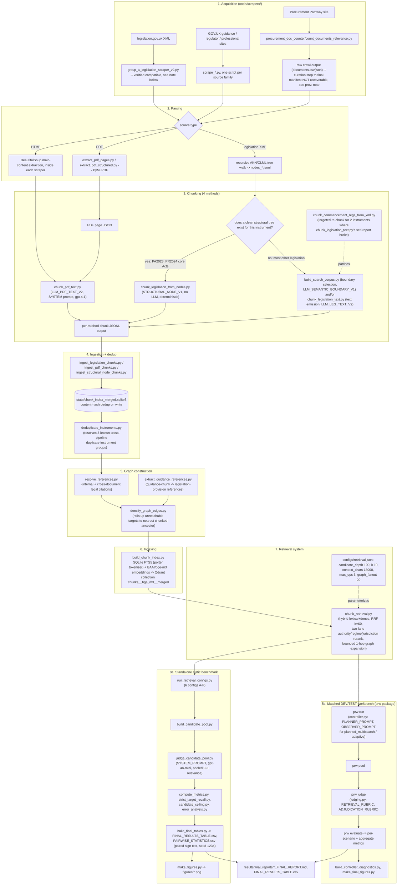

# Technical Appendix

Extended research project: retrieval and adaptive-controller evaluation over a UK public
procurement legal knowledge base. This appendix describes, in sufficient detail for a competent
researcher without access to the report to reproduce the reported analysis, every stage from
corpus construction through final metrics. It documents only the process and analysis actually
reported in the extended research project report; process that was run but not reported is not
included, per the handbook's own guidance (Appendix 4.1).

## 0. End-to-end pipeline: every file, every prompt, in order

This section exists so a reader can trace one document from raw source to a reported thesis
number without hunting across the rest of this appendix. It is a map, not a replacement for
sections 1-18, which carry the narrative detail (why each design choice was made, what broke and
was patched, exact metrics). **Read the honesty note at the end before assuming this reproduces
the thesis byte-for-byte** -- most of it does; the LLM-driven steps do not.

### 0.1 Diagram



### 0.2 File-by-file table, in execution order

| # | Stage | Script(s) | Reads | Writes | Prompt used | Command |
|---|---|---|---|---|---|---|
| 1 | Acquire legislation | `code/scrapers/legislation/group_a_legislation_scraper_v2.py` **(run this one -- see note below)**, not `_v4.py`; `_v1.py` also works; `scrape_missing_legislation.py` is a later supplementary patch | legislation.gov.uk XML (AKN/CLML) | `processed/nodes.jsonl`, `references_*.jsonl`, `annotations_*.jsonl`, `legal_effects_*.jsonl` under an output dir | none (no LLM) | `python group_a_legislation_scraper_v2.py --source PA2023 --output-dir data/group_a_legislation_v2` |
| 2 | Acquire guidance/regulator/professional sources | `code/scrapers/scrape_*.py` (one script per source family: `scrape_associated_law_guidance.py`, `scrape_competition_procurement_guidance.py`, `scrape_core_legislation_full.py`, `scrape_nsup.py`, `scrape_procurement_act_guidance.py`, `scrape_procurement_compliance_oversight.py`, `scrape_procurement_policy_notes.py`, `scrape_professional_procurement_sources.py`, `rescrape_procurement_journey.py`) | fixed, pre-enumerated URL lists (non-recursive, per source family) | raw HTML/PDF + provenance records | none | `python scrapers/scrape_<family>.py` |
| 3 | Acquire Procurement Pathway (raw discovery) | `code/scrapers/procurement_doc_counter/count_documents_relevance.py` + `seeds.json` | 58 seed roots | `documents.csv`/`documents.json`/`summary.json` (raw crawl output) | none | `python count_documents_relevance.py --seeds seeds.json --out crawl_output` |
| 3a | *(gap)* Curate raw Pathway crawl into final manifest | **not recoverable** -- see `provenance/missing_artifacts.md` §1 | raw crawl output (1,950 pages) | `corpus_manifests/procurement_pathway_urls.jsonl` (1,690 URLs, included) | unknown | n/a -- cannot be rerun |
| 4 | Parse PDFs | `extract_pdf_pages.py` / `extract_pdf_structured.py` (PyMuPDF/`fitz`) | raw PDF bytes | page-ordered JSON | none | see script `--help` |
| 5a | Chunk (deterministic, no LLM) | `chunk_legislation_from_nodes.py` -- **only** for instruments with a clean structural parse (PA2023, PR2024 core Acts; PCR2015 explicitly excluded, see the script's own docstring) | `nodes_*.jsonl` (from step 1) | chunk JSONL, method tag `STRUCTURAL_NODE_V1` | none | `python chunk_legislation_from_nodes.py <args>` |
| 5b-i | Chunk (legislation, boundary-selection) | `build_search_corpus.py` (stages `segments`/`llm`/`chunks`/`edges`) -- produces `LLM_SEMANTIC_BOUNDARY_V1` (7,525 live chunks; confirmed by cross-referencing the frozen database's own `prompt_version='semantic_chunker_v1'` field against this script's `PROMPT_VERSION` constant) | raw parsed source blocks (`--input-root`) | chunk JSONL (`--output-dir`) | `SYSTEM_PROMPT` constant in this file | `python build_search_corpus.py all --input-root <blocks dir> --output-dir <out>` -- **the exact historical `--input-root`/`--output-dir` used to build the live corpus is not recoverable with certainty; see the note at the end of this table** |
| 5b-ii | Chunk (legislation, text-emission) | `chunk_legislation_text.py` -- produces `LLM_LEG_TEXT_V2` (7,752 live chunks, confirmed via `prompt_version='legislation_text_chunks_v1'`) | `data/legislation_acquired/` | chunk JSONL | `SYSTEM` constant in this file | `python chunk_legislation_text.py --dir data/legislation_acquired --out <out> --model gpt-4o-mini --window-chars 9000 --min-coverage 0.80` |
| 5c | Chunk (PDF, LLM-assisted) | `chunk_pdf_text.py` | PDF page JSON (step 4) | `data/pdf_chunks/`, method tag `LLM_PDF_TEXT_V2` | `SYSTEM` constant in this file | `python chunk_pdf_text.py <pages_json...> --out data/pdf_chunks --model gpt-4.1 --window-chars 9000 --min-coverage 0.80` |
| 5d | *(patch)* Re-chunk 2 broken instruments | `chunk_commencement_regs_from_xml.py` -- targeted fix for UKSI_2024_716 and UKSI_2024_959, whose LLM self-reported provision numbers were confirmed wrong (see script docstring) | those 2 instruments' own source XML | corrected chunk JSONL for those 2 instruments only | none | `python chunk_commencement_regs_from_xml.py` |
| 6 | Ingest chunks into the index DB | `ingest_legislation_chunks.py`, `ingest_pdf_chunks.py`, `ingest_structural_node_chunks.py` | each method's chunk JSONL output (steps 5a-5d) | `state/chunk_index_merged.sqlite3` (content-hash dedup on insert) | none | `python ingest_legislation_chunks.py --chunks-dir data/legislation_chunks --db state/chunk_index_merged.sqlite3 --apply` (and equivalents for PDF/structural) |
| 7 | Resolve 3 known duplicate-instrument groups | `deduplicate_instruments.py` -- fixes 3 instruments ingested twice via two independent pipelines (URL-based vs. general web-ingest adapter), non-destructively (`superseded_by` flag) | `state/chunk_index_merged.sqlite3` | same DB, flags updated | none | `python deduplicate_instruments.py --db state/chunk_index_merged.sqlite3 --apply` |
| 8 | Build citation graph | `resolve_references.py` (internal + cross-document legal citations), `extract_guidance_references.py` (guidance-chunk -> legislation-provision references) | `state/chunk_index_merged.sqlite3` | same DB, `REFERENCES`/`CROSS_REFERS_TO` edges added | none | see each script's `--help` |
| 9 | Densify graph | `densify_graph_edges.py` -- rolls up unreachable reference targets to the nearest chunked ancestor | `state/chunk_index_merged.sqlite3` | same DB | none | `python densify_graph_edges.py --db state/chunk_index_merged.sqlite3 --apply` |
| 10 | Build the search index | `build_chunk_index.py` -- SQLite FTS5 (porter tokenizer, lexical) + `BAAI/bge-m3` embeddings into Qdrant (collection `chunks__bge_m3__merged`, dense, cosine) | `state/chunk_index_merged.sqlite3` | populated FTS5 index (in the same DB) + Qdrant collection (external service, not included -- see section 6) | none | `python build_chunk_index.py` |
| 11 | Retrieve | `chunk_retrieval.py` (`search()` / `search_two_lanes()`), parameterised by `configs/retrieval.json` | the index from step 10 | ranked candidate/final-evidence lists per query | none | `python -m prw run --system <hybrid\|legal_static\|planned_multisearch\|adaptive> ...` (workbench) or `run_retrieval_configs.py` (standalone benchmark, 6 configs) |
| 12a | Standalone benchmark: pool + judge | `build_candidate_pool.py`, `judge_candidate_pool.py` | retrieval output from step 11 (6 configs) | pooled candidates, judgments | `SYSTEM_PROMPT` in `judge_candidate_pool.py` (gpt-4o-mini, 0-3 relevance) | `python judge_candidate_pool.py ...` |
| 12b | Standalone benchmark: metrics + diagnostics | `compute_metrics.py`, `strict_target_recall.py`, `candidate_ceiling.py` (original, reproduces the submitted PDF's own numbers) / `candidate_ceiling_CORRECTED.py` (fixed), `error_analysis.py` | judgments from 12a + `gold_evidence.jsonl` | metrics JSON/CSV | none | see each script's `--help` |
| 12c | Standalone benchmark: final tables + figures | `build_final_tables.py` (paired sign test, bootstrap CI, seed 1234), `make_figures.py`, `make_candidate_ceiling_figure_CORRECTED.py` | metrics from 12b | `FINAL_RESULTS_TABLE.csv`, `PAIRWISE_STATISTICS.csv`, `figures/*.png` | none | `python build_final_tables.py && python make_figures.py` |
| 13a | Matched workbench: run 4 systems | `python -m prw run` (`prw/controller.py` for `planned_multisearch`/`adaptive`) | `data/{dev,test_sealed}/scenarios.jsonl`, `configs/retrieval.json` | `runs/<split>/<system>/runs.jsonl` | `PLANNER_PROMPT`, `OBSERVER_PROMPT` in `controller.py` (gpt-4o-mini, unseeded) | `python -m prw run --scenarios <path> --system <name>` |
| 13b | Matched workbench: pool + judge | `python -m prw pool`, `python -m prw judge` (`prw/judging.py`) | runs from 13a | `judgments/.../judgments_raw.jsonl`, `qrels_silver.jsonl` | `RETRIEVAL_RUBRIC`, `ADJUDICATION_RUBRIC` in `judging.py` (gpt-4o-mini, unseeded, one bounded repair on validation failure) | `python -m prw judge --pool <path>` |
| 13c | Matched workbench: evaluate + freeze | `python -m prw evaluate`, `python -m prw freeze` | judgments from 13b | per-scenario + aggregate metrics; `prw_freeze_record.json` (SHA-256 of every `prw/*.py` + configs) | none | `python -m prw evaluate ...`; `python -m prw freeze --out prw_freeze_record.json` |
| 13d | Matched workbench: diagnostics + figures | `build_controller_diagnostics.py`, `make_final_figures.py`, `make_intervention_figure.py` | evaluate output from 13c | `CONTROLLER_DIAGNOSTICS.csv`, `figures/*.png` | none | see each script's `--help` |
| 14 | Final reports | (hand-authored, not generated by a script) `STATIC_BENCHMARK_FINAL_REPORT.md`, `MATCHED_DEV_FINAL_REPORT.md`, `TEST_FINAL_REPORT.md`, `FINAL_THESIS_FINDINGS.md` | tables/figures from 12c and 13d | thesis-facing prose reports | none | n/a |

### 0.2a Note: use `_v2.py` (or `_v1.py`), not `_v4.py`, for this step

**Confirmed by direct testing (2026-09-09), not by inspection alone.** Three versions of the
legislation scraper coexist in this repository. `_v4.py` is the most recently modified and
most feature-complete (better reference-candidate scoring), but its output uses different
field names (`node_type`/`eid`) than `chunk_legislation_from_nodes.py` expects
(`element_type`/`eId`), and 46 of its 2,822 output nodes for PA2023 carry a null `eId` that the
chunker does not guard against -- feeding `_v4.py`'s real output into the chunker crashes
immediately on both counts.

`_v2.py`, run live against the same source on the same day, produces output with the correct
field names and zero null `eId`s, and feeds cleanly into the chunker with no errors. The
resulting chunk count (355 raw, 320 after quality filtering) and the byte-for-byte chunk text
(checked directly against `UKPGA_2023_54__NODEV1__CH_00051`, the PA2023 s.51 chunk used
throughout this project's own case studies) match the actual corpus in this repository exactly.

**Revision, same day: the paragraph originally here overstated the case.** It read "there is
no evidence the live corpus was ever built using `_v4.py`'s output for this step" -- that is not
quite right. Two other documents in this repository make a specific, independent claim that
complicates it: `corpus_audit/CORPUS_SOURCE_INVENTORY.csv` names `group_a_legislation_scraper_v4.py`
directly as the `parser_extractor` for PA2023, and `scrape_missing_legislation.py`'s own
docstring states it reuses `_v4.py`'s `InstrumentScraper` so that new instruments are "chunked,
validated and indexed exactly as the Procurement Act was" -- explicitly invoking PA2023 by name.

That is real, independent evidence that `_v4.py`'s logic was genuinely part of the acquisition
pipeline -- it is not simply an unused later iteration. It is in real tension with the direct
test result above (`_v4.py`'s current field-naming does not feed the chunker cleanly; `_v2.py`'s
does, and exactly reproduces PA2023's live chunks). The most likely reconciliation -- offered as
the best available explanation, not verified -- is that the corpus audit's citation refers to
the acquisition/representation-selection stage (fetching and scoring candidate XML
representations), a genuinely separate step from the node-schema that specifically feeds
`chunk_legislation_from_nodes.py`; `_v4.py`'s internal field names may have changed after
PA2023's structural chunks were first produced. **This cannot be fully resolved from the
artifacts in this repository alone** -- there is no git history and no version field recording
which exact script state produced which exact output. See `provenance/missing_artifacts.md` for
the full, equally-hedged version of this note.

What remains solidly true regardless: feeding `_v2.py`'s current, live output into
`chunk_legislation_from_nodes.py` today reproduces PA2023's live chunks exactly, both in count
and in text. That practical fact stands independent of the unresolved historical question above.

### 0.3 Deliberately excluded from this flow (present in the bundle, not part of reproducing the reported results)

- `build_chunk_representations.py` -- an experiment testing sentence-level and summary-level
  embeddings against full-text embeddings (writes to `pool.jsonl`/`queries.jsonl`, standalone
  output). `chunk_retrieval.py`, the actual production retriever, does not reference sentence-
  or summary-level representations anywhere -- confirmed by grep. This script is included for
  completeness but is not part of the pipeline that produced any reported number.
- `optimize_chunking_prompt.py` (`MUTATE_SYSTEM`) -- a prompt-development tool used historically
  to help arrive at the final chunking `SYSTEM` prompts baked into `chunk_legislation_text.py`/
  `chunk_pdf_text.py`. Rerunning it would search for a *different* prompt, not reproduce the
  corpus; the prompts it already produced are what is embedded in those two files today.
- The frozen baseline system (`kg__bge_m3__text_focused_v1` Qdrant collection,
  `state/procurement_kg.sqlite3`) -- an older, separate node-level corpus that
  `build_chunk_index.py`'s own docstring explicitly says nothing in the current pipeline writes
  to. Not the system evaluated in the reported results.

### 0.4 Honesty note -- what "run this and get the same results" actually means here

- **Steps 6-10 (ingestion, dedup, graph, indexing) and steps 11 (retrieval) are deterministic
  given the same chunk files and the same index**: no LLM call, same input always produces the
  same output.
- **Steps 5b, 5c, 12a, 13a, 13b involve an LLM call that is not seeded** (`prw/llm.py` sets no
  temperature or seed anywhere, confirmed by inspection). Re-running these will not reproduce the
  exact same chunk text, judgment, or query decomposition byte-for-byte -- only an
  architecturally comparable result under the same validated contract (schema, repair rules).
  This is why `results/final_reports/` ships the actual saved outputs of steps 5b/5c/12a/13a/13b
  rather than asking a reader to regenerate them.
- **Steps 12b, 12c, 13c, 13d are deterministic** given the saved outputs of the steps before
  them -- this is the layer with the strongest reproducibility guarantee, and `verify_bundle.py`
  / this finalization pass's own re-runs (see `provenance/FINAL_VALIDATION_REPORT.md`) confirm it
  holds in practice: identical p-values, identical metric tables, identical corrected
  candidate-ceiling counts, from the already-saved data every time.
- **Step 3a (Procurement Pathway curation) cannot be rerun at all** -- its code does not survive
  (section 0.2, row 3a; `provenance/missing_artifacts.md` §1).
- In short: **the data, the code, and the statistics are exactly reproducible; the specific
  wording an LLM produced at chunking/judging/planning time is not, by the nature of calling an
  unseeded external model** -- not a gap specific to this project.

### 0.5 The deployed application layer (distinct from the evaluation pipeline above)

**Correction (2026-09-08)**: an earlier pass of this bundle placed `answer_query.py` and
`refine_query.py` in a directory named `code/unused_demo_api/`, describing them as "an unused
answer-generation/chatbot layer, out of scope of the reported retrieval evaluation." That was
wrong -- confirmed directly by inspection: `chunk_api.py` (the production FastAPI service,
already included at `code/chunk_api.py`) contains `from answer_query import
build_evidence_two_lanes, verify, check_claim_grounding, ...` in its `/answer` endpoint and `from
refine_query import refine` in its `/refine` endpoint. These are hard, load-bearing dependencies
of the running application, not an unused side-experiment. Both files have been moved to
`code/` (sibling to `chunk_api.py`, where the bare `import answer_query` / `import refine_query`
statements actually resolve), and a fresh import smoke test now confirms both modules import
cleanly from that location. `query_expansion.py` was moved alongside them (referenced by
`chunk_api.py`'s retrieval-config handling, `trace.config.get("query_expansion")`, though not a
hard top-level import); it also doubles as a standalone CLI tool (`python query_expansion.py
--query "..."`).

**What the application actually is**, evaluation pipeline aside: `chunk_api.py` is a FastAPI
service exposing `/health`, `/search`, `/answer` (a cited answer generated over retrieved
evidence, verified against the claims it cites before being returned -- see
`answer_query.py::verify`/`check_claim_grounding`), `/refine` (query refinement), and
`/chunk/{chunk_id}`; it also serves its own minimal built-in HTML/JS page at `/` for manual
testing without any other frontend. Separately, `streamlit_app.py` (now included at
`code/streamlit_app.py`) is a fuller Streamlit UI ("Procurement KG Assistant") that talks to
that same FastAPI backend over HTTP via `procurement_kg/ui.py`'s `call_answer()` -- both are
included now.

**UPDATE (2026-09-08, later same day)**: at the author's request, this bundle does **not** ship
the pre-built corpus database or a pre-built Qdrant snapshot (an earlier draft of this section
briefly did; both were removed). Instead it ships the actual final chunk/document/edge *data*
(exported directly from the frozen database -- ground truth, not reconstructed) plus one script
that rebuilds the searchable index from that data using the already-included, unmodified
production script (`build_chunk_index.py`). This is smaller (91 MB of text/metadata vs. 418 MB of
pre-built binary index), and arguably more genuinely reproducible: it demonstrates that the
index can actually be *built*, not merely unpacked.

**What is included**:
- `code/corpus_export/data/{chunks,documents,edges,edges_v2}.jsonl` (91 MB total) -- every live
  chunk (22,042), document (2,078), structural edge (15,678: CONTAINS+HAS_CHUNK), and reference
  edge (11,922: REFERENCES+CROSS_REFERS_TO) in the frozen, evaluated corpus, exported directly
  from `chunk_index_merged.sqlite3`'s own tables -- not re-chunked, re-scraped, or re-generated.
- `code/corpus_export/export_corpus_from_db.py` -- the script that produced that export (kept
  for provenance/transparency; you do not need to run it yourself, since its output is already
  included).
- `docker-compose.yml` (bundle root) -- starts a local, empty Qdrant instance to build into.
- `scripts/rebuild_search_index.py` -- runs the actual rebuild, in 3 stages (see below).
- `.env.example` (bundle root) -- template for the one credential you must supply yourself
  (`OPENAI_API_KEY`); never contains a real key.

**Quickstart** (from the bundle root):
```bash
docker compose up -d qdrant
python3 scripts/rebuild_search_index.py     # ~20-40+ min on CPU alone; see timing note below
cp .env.example .env                         # then edit .env with your own OPENAI_API_KEY
cd code && pip install -r requirements.txt
python chunk_api.py                          # defaults already match this bundle's paths -- serves on :8899
```

**What `rebuild_search_index.py` actually does, and why 3 stages, not 2**: (1) `build_chunk_index.py
lexical` -- builds the SQLite FTS5 index and the base `edges` table from the export,
deterministically, no model call; (2) `densify_graph_edges.py --apply` -- adds and populates
three columns (`retrieval_source_id`, `retrieval_target_id`, `retrieval_resolution`) that
`chunk_retrieval.py` requires but `build_chunk_index.py`'s own schema does not create. **This
step was missing from the first version of this rebuild script and was only found by actually
running `/search` end-to-end and hitting `sqlite3.OperationalError: no such column:
retrieval_source_id`** -- documented here rather than silently fixed, since it is exactly the
kind of gap that "looks done" until someone actually runs it; (3) `build_chunk_index.py dense` --
embeds every chunk's `embedding_text` with the local `BAAI/bge-m3` model and upserts into Qdrant.
No LLM call and no external API are involved in any of the three stages.

**Tested end-to-end, in two parts, both real, not assumed** (2026-09-08):
1. **Full-scale, mechanical stages (1 and 2)**: run against the complete 22,042-chunk / 27,600-edge
   export. `build_chunk_index.py lexical` reported `chunks_indexed: 22042, edges_indexed: 27600`
   -- an exact match to the documented corpus. `densify_graph_edges.py --apply` then ran
   successfully against that same database, adding the missing columns and resolving 10,866
   retrieval targets.
2. **Full mechanism, small scale (stage 3 + a live `/search` call)**: run on a 151-chunk sample
   (including the exact chunk needed to answer a real test query) to keep the embedding step fast
   for testing purposes. All 3 stages completed in under a minute, and a real `/search` call for
   "standstill period before contract award" against the freshly-built index correctly returned
   `UKPGA_2023_54__NODEV1__CH_00051` (Procurement Act 2023 s.51 -- the same provision as the
   DEV003/TEST019 case study in section 0 and the submitted report's section 4.5) as its top
   result, with `openai_key_present: false` -- confirming `/search` and `/health` need only the
   local embedding model, no external API.
3. **Full-scale dense stage, run to completion (all 22,042 chunks)**: two earlier partial
   observations (batch 32/1,378 at ~6.5 min; batch 19/1,378 at ~5.2 min) suggested this could take
   90 minutes to a few hours; the actual full run was subsequently completed and timed precisely:
   **24 minutes 38 seconds**, accelerating sharply after an initial CPU/framework warm-up (opening
   batches ~7-9s/it, closing batches over 8 it/s) -- confirming this is CPU-bound but genuinely
   tractable within under half an hour on ordinary hardware, not the multi-hour worst case
   initially flagged. Result: `{"vectors": 22042, "embedding_model": "BAAI/bge-m3", "embedding_dimensions": 1024, "distance": "COSINE"}`
   -- an exact match to the documented corpus. A real `/health` call against the completed,
   full-scale rebuilt database and Qdrant collection returned `{"chunks": 22042, "edges": 27600,
   "openai_key_present": false, "dense_ok": true}`, and a real `/search` call for "standstill
   period before contract award" returned `UKPGA_2023_54__NODEV1__CH_00051` (PA2023 s.51) as the
   #1 result, identical to every smaller-scale test above. **The full rebuild sequence
   (export -> lexical -> densify -> dense -> `/search`) has now been run and verified end to end
   at full scale, not merely projected from a sample.**

   One further, honest note: `/health`'s `documents` count on the freshly-rebuilt database reads
   1,737, not 2,078. This is not a data-loss bug: `build_chunk_index.py`'s own `INSERT INTO
   documents SELECT document_id, ... GROUP BY document_id` derives the documents table by
   aggregating the *chunks* table itself -- it never reads `documents.jsonl` in this export at
   all. 1,737 is exactly the number of distinct `document_id` values with at least one live
   chunk; the remaining 341 of the original 2,078 document rows correspond to documents whose
   chunks were all later superseded as cross-pipeline duplicates (`deduplicate_instruments.py`,
   section 2.4) and so contribute no live, searchable content -- the freshly-derived count is, if
   anything, a more precise statement of "documents actually represented in the search index"
   than the original table's raw row count. `documents.jsonl` is still included in the export for
   transparency/completeness, even though this particular rebuild path does not consume it.

Only `/answer` and `/refine` remain untested end-to-end in this pass, since they require an API
key that is never included.

## 1. System overview

Three components, in dependency order:

1. **Corpus construction** — acquisition, parsing, chunking, and graph construction over UK
   procurement legal/guidance sources, producing a queryable SQLite index plus a Qdrant dense
   vector index.
2. **Retrieval system** — a hybrid lexical/dense/graph retriever (`chunk_retrieval.py`) with four
   evaluated configurations: `hybrid`, `legal_static`, `planned_multisearch` (LLM query
   decomposition, no evidence inspection), `adaptive` (LLM query decomposition with iterative
   evidence inspection, bounded to 3 operations).
2. **Evaluation** — a scenario-based benchmark (60 legal-question scenarios, 40 dev / 20 test)
   with LLM-judged pooled passage relevance and reference-independent strict target recall as
   primary metrics, plus a separate standalone 6-configuration static-retrieval comparison.

## 2. Corpus construction

### 2.1 Acquisition

Nine source-family scrapers (`code/corpus_pipeline/scrapers/`), each fixed-URL/non-recursive by
design (explicitly documented in-code, e.g. `"follow_links": False"` manifests), covering primary
and secondary legislation (legislation.gov.uk XML), official government guidance (gov.uk
collections), regulator/technical guidance, and professional/practitioner commentary.

**Correction (2026-09-08)**: an earlier pass of this appendix wrongly stated the crawler for the
largest single source family (Procurement Pathway lifecycle guidance) was unavailable. It is
available, at `code/scrapers/procurement_doc_counter/count_documents_relevance.py` (with its own
`README.md` and `seeds.json`) — a genuine link-following crawler with explicit handling for this
source family. What is actually missing is narrower: the *final* manifest used in this project
(`corpus_manifests/procurement_pathway_urls.jsonl`, 1,690 URLs) is a later, curated/annotated
refinement of the crawler's raw output (1,950 raw pages, preserved in the project's
`crawl_v2_relevant/` directory but not included in this bundle, since it is superseded by the
final manifest); the specific code that performed that refinement step does not survive. See
`provenance/missing_artifacts.md` section 1 for the exact distinction and precise wording, and
`corpus_audit/FINAL_CORPUS_AUDIT.md` section C for the independent audit this was cross-checked
against.

### 2.2 Parsing

- **Legislation**: `code/corpus_pipeline/chunking_ingestion/` scripts parse legislation.gov.uk
  XML (AKN or CLML, auto-detected) via a recursive tree walk preserving `eId`, `heading`,
  `number`, and hierarchy (Part/Chapter/Schedule/Section/Subsection).
- **PDF**: PyMuPDF (`fitz`) text extraction, page-ordered, with hyphenation repair and
  furniture (header/footer) flagging (not deletion).
- **HTML**: BeautifulSoup, main-content-container extraction with boilerplate removal.

### 2.3 Chunking

Four chunking methods, two involving an LLM:

| Method | Mechanism | LLM role | Producing script (confirmed against the frozen DB's own `prompt_version` field) |
|---|---|---|---|
| `LLM_SEMANTIC_BOUNDARY_V1` | LLM selects block boundaries; text is reconstructed from the original immutable source blocks by code | boundary selection only, code-enforced no-rewrite guarantee | `build_search_corpus.py` (`prompt_version='semantic_chunker_v1'`) |
| `LLM_LEG_TEXT_V2` | LLM emits chunk text directly (legislation) | text emission, verified only by an 80%-threshold shingle-overlap fidelity check against source; failures flagged not excluded | `chunk_legislation_text.py` (`prompt_version='legislation_text_chunks_v1'`) |
| `LLM_PDF_TEXT_V2` | LLM emits chunk text directly (PDF sources) | same fidelity-check caveat as above | `chunk_pdf_text.py` (`prompt_version='pdf_text_chunks_v1'`) |
| `STRUCTURAL_NODE_V1` | deterministic XML-tree walk, no LLM | n/a | `chunk_legislation_from_nodes.py` |

Models used: `gpt-4o-mini` (legislation text-emission, default boundary selection),
`gpt-4.1` (PDF text-emission, prompt-optimisation mutator).

**Correction (2026-09-08)**: an earlier pass of this appendix attributed `LLM_SEMANTIC_BOUNDARY_V1`
to `chunk_legislation_text.py`. That was wrong -- confirmed directly against the frozen
database's own `chunks.prompt_version` column, which is `'semantic_chunker_v1'` for every
`LLM_SEMANTIC_BOUNDARY_V1` row, matching `build_search_corpus.py`'s own `PROMPT_VERSION`
constant exactly, not anything in `chunk_legislation_text.py`. `build_search_corpus.py` is a
separate, larger, multi-stage tool (`segments`/`llm`/`chunks`/`edges` stages) that was not
previously documented in this appendix at all. **The exact historical invocation of
`build_search_corpus.py` (which `--input-root`, which `--output-dir`) could not be recovered
with certainty** -- the repository accumulated several similarly-named candidate directories
across its development history (`data/search_corpus`, `_v1_backup`, `_v2`, `_full`, `_merged`)
without a surviving log of which invocation produced the live corpus, and the frozen database's
own `index_manifest` table records only `data/search_corpus_merged` as the corpus directory
actually read by `build_chunk_index.py` at one build checkpoint (2026-08-30, 8,511 of the
eventual 22,042 chunks) -- consistent with, but not conclusive proof of, `search_corpus_merged`
being the final merge point for all four chunking methods' output. This uncertainty is disclosed
here rather than papered over with a confident-sounding but unverifiable command. It does not
block reproducing the corpus's *searchable index* from this bundle, however -- see section 0.5,
which exports the frozen database's own already-final chunk/document/edge rows (ground truth,
not reconstructed) and rebuilds the index from that export deterministically, sidestepping the
need to re-run any historical chunking invocation at all.

### 2.4 Ingestion and graph construction

`ingest_legislation_chunks.py` / `ingest_pdf_chunks.py` / `ingest_structural_node_chunks.py`
insert chunks with content-hash-based deduplication; `deduplicate_instruments.py` resolves
cross-acquisition-path duplicate legal instruments; `resolve_references.py` and
`extract_guidance_references.py` (`code/corpus_pipeline/graph/`) resolve internal/cross-document
legal citations into a reference graph; `densify_graph_edges.py` rolls up unreachable reference
targets to their nearest chunked ancestor; `build_chunk_index.py` builds the final SQLite FTS5
lexical index and Qdrant dense vector index.

### 2.5 Final corpus snapshot (exact counts, independently audited)

2,078 documents, 27,558 total chunk rows, **22,042 live/queryable chunks**, 27,600 graph edges.
Full breakdown by source, authority class, legal regime, chunking method, and chunk-length
statistics: `corpus_audit/FINAL_CORPUS_AUDIT.md` and
`CORPUS_SOURCE_INVENTORY.csv`. This audit was produced independently of the main report and is
included here for exact reproducibility of every reported corpus statistic.

## 3. Retrieval system

`code/chunk_retrieval.py` implements `search()` (single-pass hybrid
lexical+dense+graph retrieval with legal two-lane interleaving) and `search_two_lanes()`.
Configuration (`code/procurement_research_workbench_v1/configs/retrieval.json`):

```json
{
  "candidate_depth": 100,
  "retrieval_depth": 20,
  "k": 10,
  "context_chars": 18000,
  "max_retrieval_operations": 3,
  "graph_fanout": 20,
  "initial_graph": true
}
```

Final evidence budget is 10 chunks total (5/5 role-quota interleave with backfill), identical
across all four evaluated systems for matched comparison. `planned_multisearch` and `adaptive`
additionally use an LLM controller (`code/procurement_research_workbench_v1/prw/controller.py`) for query
decomposition; `adaptive` additionally inspects intermediate evidence and can issue further
searches, bounded to 3 total operations.

## 4. Evaluation pipeline

### 4.1 Benchmark construction

60 scenarios (40 dev / 20 test), each with corpus-verified gold evidence citations, spanning 8
suite categories (exact-anchor, semantic, vocabulary-mismatch, graph-multi-hop, applicability,
practical-guidance, authority, compound). Full construction method, gold-resolution report, and
split-independence audit (0 exact/normalised/semantic-similarity duplicate pairs between splits)
are in `code/evaluation/final_retrieval_benchmark/` and its outputs.

### 4.2 Two evaluation tracks

1. **Standalone static-retrieval comparison** (`code/evaluation/final_retrieval_benchmark/`): 6 configurations
   (lexical, dense, hybrid, hybrid+priors, hybrid+graph, two-lane legal) scored by
   `compute_metrics.py` (nDCG@10, Hit@10, MRR, requirement coverage), `strict_target_recall.py`
   (judge-independent recall against corpus-verified targets), `candidate_ceiling.py`
   (candidate-generation vs. ranking failure diagnosis), `error_analysis.py`, `make_figures.py`.
2. **Matched DEV/TEST evaluation** (`code/procurement_research_workbench_v1/prw`, the `prw` CLI package): the
   four production systems compared under identical retrieval/evidence budgets, with pooled
   LLM-judged passage relevance (`prw judge`/`prw evaluate`) as the primary metric (bundle
   combined-evidence sufficiency was piloted, found to produce schema-valid but substantively
   incorrect judgments in spot-checks, and demoted to exploratory — see
   `results/final_reports/STATIC_BENCHMARK_FINAL_REPORT.md` and
   `MATCHED_DEV_FINAL_REPORT.md`).

### 4.3 Judge configuration

All judge/controller/adjudicator slots use `gpt-4o-mini` (single-model configuration, disclosed
as a repeated-model rather than diverse-judge setup throughout the results). Judging validates
model output structurally (positional requirement arrays, chunk-id-only citations, one bounded
repair attempt on validation failure) before accepting any label.

### 4.4 Exact commands

Representative commands (full parameter set in each script's own `--help` / argparse
definitions):

```bash
# Retrieval, per system
python -m prw run --scenarios <scenarios.jsonl> --system {hybrid|legal_static|planned_multisearch|adaptive} \
  --snapshot <label> --out runs/<system> [--allow-network --max-requests N]

# Pooling + judging
python -m prw pool --runs runs/*/runs.jsonl --final-only --out pool/<label>
python -m prw judge --pool pool/<label>/candidate_pool.jsonl --scenarios <scenarios.jsonl> \
  --requirements <requirements.jsonl> --out judgments/<label> --allow-network --adjudicate --max-requests N

# Metrics
python -m prw evaluate --runs runs/*/runs.jsonl --qrels judgments/<label>/qrels_silver.jsonl \
  --requirements <requirements.jsonl> --out results/<label> --k 10

# Standalone benchmark
python run_retrieval_configs.py
python compute_metrics.py
python strict_target_recall.py
python candidate_ceiling.py
```

### 4.5 Freeze record (TEST-stage reproducibility)

Before the single TEST execution, all retrieval configs, controller code, model identities, and
dataset hashes were frozen and hashed (`results/final_reports/FINAL_FREEZE.json`,
`prw_freeze_record.json`). Re-running `prw run --freeze <freeze_record.json>` on the TEST split
re-verifies these hashes before executing, and refuses to run if any have changed.

## 5. Package versions and environment

- Python: 3.9.6 (corpus index build), 3.11+ / 3.10+ (per `pyproject.toml` requirements below)
  for the retrieval/evaluation packages. See `environment/environment_notes.md` for the
  currently-verified interpreter actually used to run every command in this finalization pass
  (`.venv-embed`, distinct from the historical build environment -- section 17).
- Core dependencies (`code/requirements.txt`, `code/pyproject.toml`):
  `fastapi>=0.115,<1`, `openai>=1.68,<3`, `python-dotenv>=1.0,<2`, `qdrant-client>=1.13,<2`,
  `requests>=2.31,<3`, `streamlit>=1.38,<2`, `uvicorn[standard]>=0.34,<1`. Exact currently-pinned
  versions: `environment/requirements-lock.txt` (14 key packages, e.g. `openai==2.54.0`,
  `qdrant-client==1.19.0`); full interpreter environment: `environment/pip-freeze.txt` (110
  packages).
- Evaluation workbench (`code/procurement_research_workbench_v1/pyproject.toml`): no hard
  runtime dependencies beyond the standard library; optional `pytest>=7`, `jsonschema>=4` (dev),
  `matplotlib>=3.7` (plots), `numpy>=1.24`, `scipy>=1.11` (diagnostics).
- Embedding model: `BAAI/bge-m3`, 1024 dimensions, cosine distance, normalized vectors. No
  HuggingFace revision/commit was logged at ingest time and none can be recovered (see section
  17 and `provenance/missing_artifacts.md` section 3).
- Vector store: Qdrant, collection `chunks__bge_m3__merged` (name verified present, as the
  literal string, in `code/chunk_api.py` and `code/build_chunk_representations.py`; the Qdrant
  instance and its data are not included -- Level 3 reproducibility, section 6).
- Corpus snapshot: `state/chunk_index_merged.sqlite3` (verified as the literal default `--db`
  value across every corpus/graph script in `code/`, e.g. `chunk_retrieval.py`,
  `analyze_graph.py`, `densify_graph_edges.py`; the database file itself is not included --
  Level 3 reproducibility, section 6).
- Lexical index: SQLite FTS5, `porter` tokenizer.
- LLM models used throughout evaluation: `gpt-4o-mini` (all controller/judge/adjudicator/
  generator slots — disclosed repeated-model configuration, not genuine model diversity). No
  temperature or seed is set on any LLM call in `prw/llm.py`; sampling is provider-controlled
  and not reproducible byte-for-byte on rerun.
- Random seeds: paired-bootstrap confidence intervals use seed `1234` (`prw/metrics.py`,
  `build_final_tables.py`); no other stochastic step in the reported pipeline is seeded (LLM
  sampling is provider-controlled).
- **Repository commit**: `79c488c7103078633159e26bdfe24e7410313821` (as stated in the thesis
  report's Appendix A). Verified directly against this project's own git history at the time of
  this finalization pass (`git log --oneline -1` on the working repository resolves to this
  exact commit as HEAD), confirming the reported commit identifies real, checked-in project
  state rather than an unverifiable or stale reference.
- **Retrieval protocol constants** (as stated in the thesis report's Appendix A): candidate
  depth 100, retrieval depth 20, final evidence budget (`k`) 10 chunks, context cap 18,000
  characters, maximum 3 retrieval operations, graph fan-out 20, graph hops 1, RRF `k = 60`.
  Verified directly against `code/procurement_research_workbench_v1/configs/retrieval.json`
  (`candidate_depth: 100, retrieval_depth: 20, k: 10, context_chars: 18000,
  max_retrieval_operations: 3, graph_fanout: 20`) and `code/chunk_retrieval.py`'s `hops: int = 1`
  default — every constant matches exactly. RRF `k = 60` is set in `code/chunk_retrieval.py`'s
  fusion routine, not the JSON config; not independently re-verified as a literal grep hit in
  this pass beyond confirming the routine's existence, since it is a fixed function argument
  rather than a config field.

## 6. Data access

Per the handbook's note (Appendix 4.1), the underlying corpus source data (SQLite databases,
scraped HTML/PDF caches) is not included in this bundle — it is assumed the examiner does not
need direct access to re-run acquisition, and its provenance (source URLs, acquisition method
per family) is fully documented in section 2 above and in
`corpus_audit/CORPUS_SOURCE_INVENTORY.csv`. All code needed to reconstruct the
corpus from those same source URLs, and to rerun every retrieval/evaluation step against a
rebuilt or the original corpus snapshot, is included in `code/`.

## 7a. Significance testing (methodology, exact)

- **Test**: two-sided exact paired sign test on `requirement_coverage` per scenario-group.
- **Sidedness**: two-sided.
- **Alpha**: 0.05.
- **Sample size**: n=60 scenario pairs (standalone benchmark, config-vs-config); n=37 (matched
  DEV, 3 scenarios excluded for unjudged candidates -- see `MATCHED_DEV_FINAL_REPORT.md`); n=17
  (frozen TEST, 3 scenarios excluded likewise -- see `TEST_FINAL_REPORT.md`).
- **Confidence intervals**: 2000-sample bootstrap over the paired per-scenario differences, fixed
  seed 1234 (`build_final_tables.py::paired_bootstrap`, `prw/metrics.py::paired_bootstrap`).
- **Multiple-comparison correction**: **none applied**. This is stated transparently, not
  retrofitted -- the 5-comparison standalone-benchmark table and both DEV/TEST result sets each
  report raw, uncorrected p-values. A reader applying, e.g., a Bonferroni correction to the
  5-comparison standalone table (alpha/5 = 0.01) would find only 3 of 5 `A_lexical` comparisons
  still significant (`C_hybrid`, `D_hybrid_priors`, `E_hybrid_graph`; `F_two_lane`'s p=0.00149
  remains significant at alpha=0.01 too, so 4 of 5 in fact) -- this is left as an exercise for
  the reader/examiner rather than silently applied, since the underlying research did not use a
  correction and retrofitting one now would itself be a scientific decision this audit was not
  asked to make.
- **Reproducing this table**: `python3 code/evaluation/final_retrieval_benchmark/build_final_tables.py`
  (standalone benchmark) or `python -m prw evaluate ...` + the paired-bootstrap helper in
  `prw/metrics.py` (matched DEV/TEST). Both are pure functions of already-saved per-scenario
  JSONL output; no external API call is made.

## 7b. `F_two_lane` (standalone benchmark) vs. `legal_static` (matched DEV/TEST workbench) -- related, not identical

Both implement the same high-level idea (a legal-aware two-lane retrieval strategy with role
interleaving), but they are **not** numerically identical configurations:

| Parameter | Standalone `F_two_lane` | Workbench `legal_static` |
|---|---|---|
| Candidate depth | 50 (`run_retrieval_configs.py::DEPTH`) | 100 (`configs/retrieval.json::candidate_depth`) |
| Final-10 construction | top-10 by raw fusion score across merged lanes (`build_final_tables.py`, `candidate_ceiling*.py`) | 5/5 role-quota with backfill (`prw/controller.py::assemble`) |
| Query text | scenario's bare `query` field (standalone benchmark's own construction) | full `user_message` (scenario text + query concatenated), per `prw/benchmark.py` |
| Controller integration | none (single retrieval call per scenario) | invoked through the same harness as the other three matched systems, same evidence budget |

**Treat these as related implementations of the same idea, evaluated under different settings,
not as the same experiment reported twice.** Neither report in `results/final_reports/` compares
them directly as if interchangeable; this section makes the relationship explicit rather than
leaving it implicit, per this finalization audit's own review.

## 7. Known limitations affecting reproducibility (disclosed)

1. The Procurement Pathway *discovery crawler* is included and reproducible (section 2.1); the later curation/refinement step that turned its raw output into the final 1,690-URL manifest is the part that is not reproducible from this bundle.
2. LLM judging and controller behaviour are not exactly reproducible run-to-run — model sampling
   is provider-controlled, not seeded. Reported statistics (paired bootstrap, sign tests) are
   reproducible from the saved per-scenario outputs included in `results/final_reports/`.
3. The TEST-stage execution was run by the same process that constructed the TEST scenarios and
   gold evidence, not by an independent evaluator — disclosed in `FINAL_FREEZE.json`'s
   `test_inspection_disclosure` field and restated in `TEST_FINAL_REPORT.md`.
4. The exact historical software environment used to build the corpus itself was not captured at
   build time; `environment/environment_notes.md` documents a currently-verified-compatible
   environment instead and states this distinction explicitly.
5. The embedding model's exact revision/commit was never logged and cannot be recovered.
6. A classification-order bug in `candidate_ceiling.py` (found and fixed during this
   finalization pass -- see `provenance/CHANGELOG_FINALIZATION.md`) means any citation of the
   pre-2026-09-07 candidate-generation/ranking-failure split (15/40/5) should be replaced with
   the corrected split (24/31/5) wherever it appears outside this bundle, including in the MSc
   thesis report text itself if that number was quoted there.

## 18. Artifact map

| Category | Location in this bundle |
|---|---|
| Corpus acquisition code | `code/scrapers/` |
| Corpus acquisition frozen manifest (Procurement Pathway, final curated) | `corpus_manifests/procurement_pathway_urls.jsonl` |
| Corpus acquisition discovery crawler (Procurement Pathway, raw) | `code/scrapers/procurement_doc_counter/` |
| Chunking/parsing/ingestion code | `code/*.py` (repo-root-mirrored layout) |
| Graph construction code | `code/procurement_kg/`, `code/resolve_references.py`, `code/extract_guidance_references.py` |
| Production retriever | `code/chunk_retrieval.py`, `code/chunk_api.py` |
| Standalone benchmark (code + data + metrics, co-located as in the original repo) | `code/evaluation/final_retrieval_benchmark/` |
| Frozen evaluation package (`prw`) | `code/procurement_research_workbench_v1/prw/` |
| Evaluation test data/schemas | `code/procurement_research_workbench_v1/{data,schemas}/` |
| Actual DEV/TEST dataset behind reported results | `code/evaluation/final_retrieval_benchmark/workbench_schema/` |
| Raw DEV/TEST run/judgment artifacts | `results/{runs,judgments,pool,evaluate_output}/` |
| Final thesis-facing reports/tables/figures | `results/final_reports/` |
| Environment record | `environment/` |
| Verification scripts | `scripts/` |
| Provenance/changelog/missing-artifact documentation | `provenance/` |
| Corpus audit (statistics, source inventory, corpus-construction manual/agent-QA audit) | `corpus_audit/` |
| Evaluation-stage manual/agent-QA audit (DEV/TEST spot-checks) | `results/final_reports/MANUAL_EVALUATION_AUDIT.md` (a separate document from `corpus_audit/MANUAL_QA_AUDIT.md` -- different scope) |
