# Technical Appendix

Retrieval and adaptive-controller evaluation over a UK public procurement legal knowledge base.
This describes every stage from corpus construction through final metrics, in enough detail to
reproduce the reported analysis.

**Just want the commands to run, in order? Go to `README.md`'s "Quickstart" section instead --
that's where the actual step-by-step commands are.** This document explains how everything
works and why it was built this way; it is not itself a run-in-order checklist.

## 0. End-to-end pipeline

### 0.1 Diagram

**Read this diagram top to bottom as a strict build order, not a menu.** Every arrow is a
real file dependency verified against the actual code (not inferred from naming): the box an
arrow points into reads the file(s) the box it left behind actually wrote. The single most
important rule the earlier, informal version of this diagram got wrong: **`build_chunk_index.py
lexical` (step 5) must run before `ingest_*.py` (step 6), and never again after** -- it does a
destructive `DELETE FROM chunks/edges/documents` before every re-insert, so running it a second
time after step 6 has added rows would silently erase them. Steps 6-7 add to the database
directly; step 8's re-export is what lets step 9 (the dense/vector index) see everything steps
6-7 added, since step 9 embeds from a JSONL export, not from the live database.

```mermaid
flowchart TD
    subgraph ACQ["1. Acquisition (code/scrapers/)"]
        A1[legislation.gov.uk XML] --> A2["group_a_legislation_scraper_v4.py"]
        A3[GOV.UK guidance / regulator / professional sites] --> A4[scrape_*.py, one script per source family]
        A5[Procurement Pathway site] --> A6[procurement_doc_counter/count_documents_relevance.py]
        A6 --> A7["raw crawl output (documents.csv/json)"]
    end

    A2 --> P1
    A4 --> P1
    A7 --> P1

    subgraph PARSE["2. Parsing"]
        P1{source type}
        P1 -->|legislation XML| P2[recursive AKN/CLML tree walk -> nodes_*.jsonl]
        P1 -->|PDF| P3[extract_pdf_pages.py / extract_pdf_structured.py -- PyMuPDF]
        P1 -->|HTML| P4[BeautifulSoup main-content extraction, inside each scraper]
    end

    P2 --> C1
    P3 --> C3
    P4 --> C1B

    subgraph CHUNK["3. Chunking (4 methods, independent outputs)"]
        C1{clean structural tree available?}
        C1 -->|yes: PA2023, PR2024 core Acts| C1A["chunk_legislation_from_nodes.py\n(STRUCTURAL_NODE_V1, no LLM, deterministic)"]
        C1 -->|no: most other legislation| C1B["build_search_corpus.py (LLM_SEMANTIC_BOUNDARY_V1)\nand/or chunk_legislation_text.py (LLM_LEG_TEXT_V2)\n-- build_search_corpus.py ALSO writes the base JSONL\ncorpus (data/search_corpus/chunks.jsonl, edges.jsonl)\nthat step 5 below bootstraps the database from"]
        C2["chunk_pdf_text.py\n(LLM_PDF_TEXT_V2, gpt-4.1)"]
        C3["PDF page JSON"] --> C2
        CPATCH["chunk_commencement_regs_from_xml.py\n(targeted re-chunk, 2 instruments)"] -.patches.-> C1B
    end

    C1A --> I1
    C2 --> I1
    C1B --> GR1
    C1B --> GR2

    subgraph GRAPH["4. Reference resolution (pure JSONL -- no database involved yet)"]
        GR1["resolve_references.py\ninternal + cross-document legal citations\n-> edges_v2.jsonl"]
        GR2["extract_guidance_references.py\nguidance-chunk -> legislation-provision refs\n-> edges_guidance_refs.jsonl"]
    end

    GR1 --> IDX1
    GR2 --> IDX1
    C1B --> IDX1

    subgraph BOOT["5. Bootstrap the database -- build_chunk_index.py 'lexical' stage,\nrun exactly ONCE, right here"]
        IDX1["reads chunks.jsonl + edges.jsonl + edges_v2.jsonl +\nedges_guidance_refs.jsonl -> CREATEs and populates\nstate/chunk_index_merged.sqlite3 for the first time"]
    end

    IDX1 --> I1

    subgraph INGEST["6. Ingest the other chunking methods\n(additive -- the database already exists)"]
        I1["ingest_structural_node_chunks.py /\ningest_legislation_chunks.py /\ningest_pdf_chunks.py\nINSERT OR REPLACE by chunk_id. Never re-run step 5's\nlexical stage after this: it DELETEs and rebuilds\nthese tables from scratch"]
    end

    I1 --> DD1

    subgraph CLEAN["7. Dedup + densify (in-place updates to the same database)"]
        DD1["deduplicate_instruments.py --apply\nflags cross-pipeline duplicate instruments"]
        DD2["densify_graph_edges.py --apply\nrolls up unreachable reference targets"]
        DD1 --> DD2
    end

    DD2 -.optional backfill loop, table rows 11a-c.-> BF1["collect_missing_references.py ->\nscrape_missing_legislation.py -> folds new\ninstruments back through steps 3-7"]
    BF1 -.-> DD2
    DD2 --> EXP1

    subgraph EXPORT["8. Re-export the database back to JSONL\n(the bridge a from-scratch build must not skip)"]
        EXP1["export_corpus_from_db.py --db state/chunk_index_merged.sqlite3\nwithout this, step 9 embeds a stale corpus missing\neverything steps 6-7 just added"]
    end

    EXP1 --> IDX2

    subgraph DENSE["9. Build the dense/vector index"]
        IDX2["build_chunk_index.py dense --corpus-dir <step 8 output>\nBAAI/bge-m3 embeddings -> Qdrant\ncollection chunks__bge_m3__merged"]
    end

    IDX2 --> RET1

    subgraph RETRIEVAL["10. Retrieval system"]
        RET1["chunk_retrieval.py\nhybrid lexical+dense, RRF k=60,\ntwo-lane authority/regime/jurisdiction rerank,\nbounded 1-hop graph expansion"]
        RET2[configs/retrieval.json: candidate_depth 100, k 10,\ncontext_chars 18000, max_ops 3, graph_fanout 20]
        RET2 -.parameterizes.-> RET1
    end

    RET1 --> EVAL1
    RET1 --> EVAL2

    subgraph EVALA["11a. Standalone static benchmark"]
        EVAL1["run_retrieval_configs.py (6 configs A-F)"] --> EVAL1B["build_candidate_pool.py"]
        EVAL1B --> EVAL1C["judge_candidate_pool.py\n(gpt-4o-mini, pooled 0-3 relevance)"]
        EVAL1C --> EVAL1D["compute_metrics.py, strict_target_recall.py,\ncandidate_ceiling.py, error_analysis.py"]
        EVAL1D --> EVAL1E["build_final_tables.py -> FINAL_RESULTS_TABLE.csv,\nPAIRWISE_STATISTICS.csv (paired sign test, seed 1234)"]
        EVAL1E --> EVAL1F["make_figures.py -> figures/*.png"]
    end

    subgraph EVALB["11b. Matched DEV/TEST workbench (prw package --\nsee docs/workflow.mmd for the 3-track judging methodology)"]
        EVAL2["prw run (controller.py: LLM query decomposition\nfor planned_multisearch / adaptive)"] --> EVAL2B["prw pool"]
        EVAL2B --> EVAL2C["prw judge / prw judge-bundles / prw judge-answers\n(3 separate judging tracks)"]
        EVAL2C --> EVAL2D["prw evaluate -> per-scenario + aggregate metrics"]
        EVAL2D --> EVAL2E["build_controller_diagnostics.py, make_final_figures.py"]
    end
```



### 0.2 File-by-file table, in execution order

This table is a real, runnable, sequential build -- row order is dependency order, top to
bottom, every "Reads" column naming the exact file(s) the previous row(s) wrote -- for building
the corpus from scratch, from raw web sources through to a working, queryable database. **You
do not have to run it, though**: the actual final, evaluated database's content is already
exported and shipped in this bundle
(`code/corpus_export/data/{chunks,documents,edges,edges_v2}.jsonl`), and
`scripts/rebuild_search_index.py` (section 0.5) rebuilds a fully working search index directly
from that export in minutes, no scraping or LLM calls involved. Use the table below only if you
specifically want to reproduce or audit the *acquisition* methodology itself -- and note that
re-scraping live sources is not guaranteed to reproduce byte-identical results (see "What is and
is not exactly reproducible" in `README.md`). To spot-check the one lane that involves no LLM at
all, see `scripts/verify_deterministic_chunking.py` (README.md, "Verify the deterministic
chunking lane"). Section 0.6 below, "Evaluation methodology", picks up exactly where row 14 of
this table (retrieval) leaves off, and states plainly which of rows 1-14 you actually need to
have run before each evaluation command works.

| # | Stage | Script(s) | Reads | Writes | Command |
|---|---|---|---|---|---|
| 1 | Acquire legislation | `code/scrapers/legislation/group_a_legislation_scraper_v4.py`. Needs `requests` and `lxml` (both in `code/requirements.txt`). Run from `code/`, since `--output-dir` is relative to it, not to `scrapers/legislation/` | legislation.gov.uk XML (AKN/CLML) | `processed/nodes.jsonl`, `references_*.jsonl`, `annotations_*.jsonl`, `legal_effects_*.jsonl` | `cd code && python scrapers/legislation/group_a_legislation_scraper_v4.py --source ALL --output-dir data/group_a_legislation_v4` (`--source` also accepts `PA2023`/`PR2024`/`PCR2015` individually; `ALL` gets all three in one run) |
| 2 | Acquire guidance/regulator/professional sources | `code/scrapers/`: `scrape_associated_law_guidance.py`, `scrape_competition_procurement_guidance.py`, `scrape_nsup.py`, `scrape_procurement_act_guidance.py`, `scrape_procurement_compliance_oversight.py`, `scrape_procurement_policy_notes.py`, `scrape_professional_procurement_sources.py` -- each runs with no arguments, using its own built-in, fixed URL list. | fixed, pre-enumerated URL lists | raw HTML/PDF + provenance records | `python scrapers/scrape_associated_law_guidance.py` (repeat for each script above) |
| 3 | Acquire Procurement Pathway (raw discovery) | `code/scrapers/procurement_doc_counter/count_documents_relevance.py` + `seeds.json` -- `--seeds seeds.json` is a relative path resolved against the current directory, not the script's location; run this from `code/scrapers/procurement_doc_counter/` itself, or the default `seeds.json` won't be found | 58 seed roots | `documents.csv`/`documents.json`/`summary.json` | `cd code/scrapers/procurement_doc_counter && python count_documents_relevance.py --seeds seeds.json --out crawl_output` |
| 4 | Parse PDFs | `extract_pdf_pages.py` / `extract_pdf_structured.py` (PyMuPDF/`fitz`) | raw PDF bytes | page-ordered JSON | see script `--help` |
| 5a | Chunk (deterministic, no LLM) | `chunk_legislation_from_nodes.py` -- for instruments with a clean structural parse (PA2023, PR2024 core Acts) | `nodes_*.jsonl` | chunk JSONL, method tag `STRUCTURAL_NODE_V1` | `python chunk_legislation_from_nodes.py --doc <id> --nodes <path> --out <path>` |
| 5b-i | Chunk (legislation, boundary-selection) -- **also writes the base corpus rows 6-7 below read** | `build_search_corpus.py` -- produces `LLM_SEMANTIC_BOUNDARY_V1` | raw parsed source blocks (`--input-root`) | `data/search_corpus/{parent_segments,chunk_boundaries,chunks,chunk_validation,edges,unresolved_references}.jsonl` (`--output-dir`) | `python build_search_corpus.py all --input-root <blocks dir> --output-dir data/search_corpus --model gpt-4o-mini` (`--model` or the `CHUNK_MODEL` env var is **required** for `stage all`/`llm` -- confirmed live: the command crashes immediately with `RuntimeError: --model or CHUNK_MODEL required` without it; `OPENAI_API_KEY` must also be set) |
| 5b-ii | Chunk (legislation, text-emission) | `chunk_legislation_text.py` -- produces `LLM_LEG_TEXT_V2` | `data/legislation_acquired/` | chunk JSONL | `python chunk_legislation_text.py --dir data/legislation_acquired --out <out> --model gpt-4o-mini --window-chars 9000 --min-coverage 0.80` |
| 5c | Chunk (PDF, LLM-assisted) | `chunk_pdf_text.py` -- produces `LLM_PDF_TEXT_V2` | PDF page JSON (step 4) | `data/pdf_chunks/` | `python chunk_pdf_text.py <pages_json...> --out data/pdf_chunks --model gpt-4.1 --window-chars 9000 --min-coverage 0.80` |
| 5d | Targeted re-chunk (2 instruments) | `chunk_commencement_regs_from_xml.py` -- fixes UKSI_2024_716 and UKSI_2024_959. Takes `--doc`/`--xml`/`--out`, all **required** (the bare command with no arguments fails immediately with an argparse error); must be run once per instrument. `--xml` needs each instrument's own raw source XML, not row 1's `nodes.jsonl` -- fetch it directly (confirmed working) | source XML from `https://www.legislation.gov.uk/uksi/2024/{716,959}/made/data.xml` | corrected chunk JSONL | `curl -o UKSI_2024_716.xml https://www.legislation.gov.uk/uksi/2024/716/made/data.xml && python chunk_commencement_regs_from_xml.py --doc UKSI_2024_716 --xml UKSI_2024_716.xml --out data/legislation_chunks/UKSI_2024_716.json` (repeat with `--doc UKSI_2024_959`, its own `.xml`, and its own `--out` path) |
| 6 | Resolve the citation graph (pure JSONL -- no database exists yet) | `resolve_references.py`, `extract_guidance_references.py` -- **both also read `data/group_a_legislation_v4/*/nodes_*.jsonl` (row 1's raw scraper output) from a path fixed relative to `code/`, not from `--corpus-dir`**; run these two scripts from `code/` with row 1's output left at its default location, or this step will not find it | `data/search_corpus/{parent_segments,chunks,unresolved_references}.jsonl` (from row 5b-i) + `data/group_a_legislation_v4/*/nodes_*.jsonl` (from row 1) | `data/search_corpus/{edges_v2,unresolved_references_v2,reference_resolution_all,edges_guidance_refs}.jsonl` | `cd code && python resolve_references.py --corpus-dir data/search_corpus && python extract_guidance_references.py --corpus-dir data/search_corpus` |
| 7 | Bootstrap the index database -- **run this exactly once, before row 8, never again after** | `build_chunk_index.py lexical` | the four JSONL files `data/search_corpus/{chunks,edges,edges_v2,edges_guidance_refs}.jsonl` (rows 5b-i and 6) | `state/chunk_index_merged.sqlite3` -- created here, for the first time | `python build_chunk_index.py lexical --corpus-dir data/search_corpus --db state/chunk_index_merged.sqlite3` |
| 8 | Ingest the other 3 chunking methods (additive -- the database from row 7 already exists) | `ingest_legislation_chunks.py`, `ingest_pdf_chunks.py`, `ingest_structural_node_chunks.py` | each method's own chunk JSONL (rows 5b-ii, 5c, 5a/5d) + the DB from row 7 | same DB, rows added by `INSERT OR REPLACE` | `python ingest_legislation_chunks.py --chunks-dir data/legislation_chunks --db state/chunk_index_merged.sqlite3 --apply` (repeat with `ingest_pdf_chunks.py --chunks-dir data/pdf_chunks_mini --db ... --apply` and `ingest_structural_node_chunks.py --chunks <path...> --db ... --apply`) |
| 9 | Resolve duplicate-instrument groups | `deduplicate_instruments.py` -- flags cross-pipeline duplicate instruments non-destructively (`superseded_by`) | DB from row 8 | same DB, flags updated | `python deduplicate_instruments.py --db state/chunk_index_merged.sqlite3 --apply` |
| 10 | Densify graph | `densify_graph_edges.py` -- rolls up unreachable reference targets to their nearest chunked ancestor | DB from row 9 | same DB, `retrieval_target_id`/`retrieval_resolution`/`retrieval_source_id` columns added and populated | `python densify_graph_edges.py --db state/chunk_index_merged.sqlite3 --apply` |
| 11a | Rank cited-but-missing instruments (**optional backfill loop** -- needs rows 6 and 8 already done, which is why this isn't row 1b) | `collect_missing_references.py` -- reads the now-ingested-and-resolved corpus's held documents/URLs plus raw hyperlink records, AKN citation targets, and the full reference-resolution report to rank what's missing by citation frequency | DB (rows 8-10), `normalized_html_json_v2/records/`, `corpus_minor_formats/xml/`, `data/search_corpus/reference_resolution_all.jsonl` (row 6; all included) | `evaluation/acquisition/missing_references.jsonl` | `cd code && python collect_missing_references.py --min-citations 1` |
| 11b | Acquire the ranked missing instruments | `scrapers/legislation/scrape_missing_legislation.py` | `evaluation/acquisition/missing_references.jsonl` (from 11a), the DB | same raw outputs as row 1, for the newly acquired instruments only | `python scrapers/legislation/scrape_missing_legislation.py --top 10 --apply` |
| 11c | Fold the newly acquired instruments back in | Repeat row 5 (whichever chunking method fits each new instrument), then row 6 (resolve references again -- some previously-unresolved citations now have a target), then row 8 (ingest), row 9 (dedupe), row 10 (densify), for the instruments 11b acquired only | outputs of 11b | same DB, updated with the new instruments' chunks and edges | (same commands as rows 5/6/8/9/10, scoped to the new instruments) |
| 12 | Re-export the database back to JSONL -- **the bridge a from-scratch build must not skip** | `export_corpus_from_db.py` -- a plain data export, no LLM call, no re-chunking, no re-scraping | DB from row 10 (or 11c, if you ran the backfill loop) | a fresh export directory: `chunks.jsonl`, `documents.jsonl`, `edges.jsonl`, `edges_v2.jsonl` | `python corpus_export/export_corpus_from_db.py --db state/chunk_index_merged.sqlite3 --out corpus_export/data_rebuilt` |
| 13 | Build the dense/vector index | `build_chunk_index.py dense` -- `BAAI/bge-m3` embeddings, local model, no external API call | row 12's export directory | Qdrant collection `chunks__bge_m3__merged` + the DB's `index_manifest` table | `python build_chunk_index.py dense --corpus-dir corpus_export/data_rebuilt --db state/chunk_index_merged.sqlite3 --collection chunks__bge_m3__merged` (the two `--db`/`--collection` values are not this script's own defaults -- they must be passed explicitly so this points at the same database and collection name `chunk_retrieval.py`, `chunk_api.py`, and the `prw` workbench all actually read) |
| 14 | Retrieve | `chunk_retrieval.py` (`search()` / `search_two_lanes()`), parameterised by `configs/retrieval.json` | the DB + Qdrant collection from row 13 | ranked candidate/final-evidence lists | `python -m prw run --system {hybrid,legal_static,planned_multisearch,adaptive} ...` or `run_retrieval_configs.py` (standalone, 6 configs) -- see section 0.6 for the full evaluation commands built on top of this |
| 15a | Standalone benchmark: pool + judge | `build_candidate_pool.py`, `judge_candidate_pool.py` | retrieval output (6 configs) | pooled candidates, judgments | `python judge_candidate_pool.py ...` |
| 15b | Standalone benchmark: metrics + diagnostics | `compute_metrics.py`, `strict_target_recall.py`, `candidate_ceiling.py`, `error_analysis.py` | judgments + `gold_evidence.jsonl` (see `provenance/missing_artifacts.md` item 7 for a known, unfixed citation-resolution bug affecting some of `gold_evidence.jsonl`'s regulation-style targets) | metrics JSON/CSV | see each script's `--help` |
| 15c | Standalone benchmark: final tables + figures | `build_final_tables.py` (paired sign test, bootstrap CI, seed 1234), `make_figures.py` | metrics from 15b | `FINAL_RESULTS_TABLE.csv`, `PAIRWISE_STATISTICS.csv`, `figures/*.png` | `python build_final_tables.py && python make_figures.py` |
| 16a | Matched workbench: run 4 systems | `python -m prw run` | `data/{dev,test_sealed}/scenarios.jsonl`, `configs/retrieval.json` | `results/runs/<split>/<system>/runs.jsonl` | see section 0.6 for the full command |
| 16b | Matched workbench: pool + judge | `python -m prw pool`, `python -m prw judge` / `judge-bundles` / `judge-answers` | runs from 16a | `results/judgments/.../judgments_raw.jsonl`, `qrels_silver.jsonl`, `bundle_consensus.jsonl`, `answer_consensus.jsonl` | see section 0.6 |
| 16c | Matched workbench: evaluate + freeze | `python -m prw evaluate`, `python -m prw freeze` | judgments from 16b | per-scenario + aggregate metrics; `prw_freeze_record.json` | see section 0.6 |
| 16d | Matched workbench: diagnostics + figures | `build_controller_diagnostics.py`, `make_final_figures.py` | evaluate output from 16c | `CONTROLLER_DIAGNOSTICS.csv`, `figures/*.png` | see each script's `--help` |

Rows 11a-11c (backfilling cited-but-missing instruments) sit where they do, not right after row
1, because `collect_missing_references.py` ranks what's missing partly from the reference
resolver's own output (row 6), which itself needs the base corpus already chunked (row 5b-i).
Both scripts and all of their raw inputs are included in this bundle
(`normalized_html_json_v2/records/`, `corpus_minor_formats/xml/`,
`data/search_corpus/reference_resolution_all.jsonl`), so this backfill is fully re-runnable --
just genuinely later in the sequence, not a two-command follow-up to row 1. Row 11c (folding
the newly acquired instruments back through chunking/resolution/ingestion) is what makes them
actually show up in the final graph and index; skipping it leaves 11b's acquired files on disk
but absent from the database.

Row 7 is the step earlier drafts of this document omitted entirely, and it is the one every
other row's correctness depends on: `build_chunk_index.py lexical` is *destructive* --
`con.execute("DELETE FROM chunks")` (and the same for `edges`, `documents`, `chunks_fts`) runs
unconditionally before every re-insert. Run it before row 8's incremental `ingest_*.py` scripts
have added anything, and it is a safe, idempotent bootstrap. Run it again afterward -- for
instance, out of habit, to "rebuild the index" -- and it silently erases every chunk rows 8-11
added, because it only ever repopulates itself from row 5b-i's `chunks.jsonl`, which never had
those chunks in the first place. Row 12 (`export_corpus_from_db.py`) exists precisely so this
mistake is never necessary: once the database is complete, re-exporting it to a fresh directory
and pointing row 13's `dense` stage at that export (never at row 5b-i's original, now-partial
`data/search_corpus/`) is the correct way to pick up rows 8-11's additions in the search index,
with zero risk to the lexical/graph tables already built.

### 0.3 Not part of reproducing the reported results

- The frozen baseline system (`kg__bge_m3__text_focused_v1` Qdrant collection,
  `state/procurement_kg.sqlite3`) -- an older, separate node-level corpus not used by the
  current pipeline. Not shipped in this bundle; mentioned here only because `build_chunk_index.py`'s
  own docstring names it, to make clear it's not something you need to build separately.

### 0.4 Reproducibility scope

- Ingestion, dedup, graph construction, indexing, and retrieval are deterministic given the
  same chunk files and index.
- Corpus text-emission chunking, controller planning/observation, and judging call an LLM with
  no fixed temperature/seed (`prw/llm.py`) -- these are not byte-for-byte reproducible on
  rerun. `results/` ships the actual saved outputs of these steps.
- Metrics/tables/figures computed from already-saved data (table 0.2 rows 15b, 15c, 16c, 16d)
  are deterministic.
- The Procurement Pathway curation step (raw crawl -> final annotated manifest) cannot be
  rerun; see `provenance/missing_artifacts.md`.

### 0.5 The deployed application layer

`chunk_api.py` is a FastAPI service exposing `/health`, `/search`, `/answer` (a cited answer
generated over retrieved evidence, verified against the claims it cites -- see
`answer_query.py::verify`/`check_claim_grounding`), `/refine`, and `/chunk/{chunk_id}`; it also
serves a minimal built-in HTML/JS page at `/`. `streamlit_app.py` is a fuller Streamlit UI
("Procurement KG Assistant") that talks to the same backend via its own small, self-contained
`call_answer()`/`normalize_base_url()` helpers. Required siblings:
`answer_query.py`, `refine_query.py`, `query_expansion.py`
(all at `code/`, sibling to `chunk_api.py`, where its bare `import` statements resolve).

This bundle ships the actual final chunk/document/edge data
(`code/corpus_export/data/{chunks,documents,edges,edges_v2}.jsonl`, 91 MB: every live chunk
(22,042), document (2,078), structural edge (15,678), and reference edge (11,922), exported
directly from the frozen database) rather than a pre-built database or vector-index binary.
`scripts/rebuild_search_index.py` rebuilds a working index from this export in 3 stages:

1. `build_chunk_index.py lexical` -- builds the SQLite FTS5 index and base `edges` table,
   deterministically, no model call.
2. `densify_graph_edges.py --apply` -- adds and populates the `retrieval_source_id`,
   `retrieval_target_id`, `retrieval_resolution` columns `chunk_retrieval.py` requires.
3. `build_chunk_index.py dense` -- embeds every chunk's `embedding_text` with the local
   `BAAI/bge-m3` model and upserts into Qdrant. No external API call.

Run against the complete 22,042-chunk / 27,600-edge export, the dense stage takes roughly
25 minutes on CPU alone. `/search` and `/health` require no OpenAI API key; only `/answer` and
`/refine` do. `/health`'s `documents` count on a freshly-rebuilt database reads 1,737, not
2,078 -- `build_chunk_index.py` derives the documents table by aggregating the *chunks* table
itself, so it counts only documents with at least one live chunk; the remaining 341 correspond
to documents whose chunks were all superseded as cross-pipeline duplicates. A freshly-rebuilt
database's `documents` table is, in this one respect, actually *more* complete than the shipped
`code/corpus_export/data/documents.jsonl`: 17 documents (15 chunked by `chunk_legislation_text.py`,
2 by `chunk_legislation_from_nodes.py`) have live chunks in the export's `chunks.jsonl` but no
row at all in its `documents.jsonl` -- an artifact of table 0.2's row 7/row 8 split (the
`documents` table is only ever populated once, from whatever `chunks.jsonl` existed at the time
row 7's `lexical` stage last ran; these 17 were added afterward, by row 8's `ingest_*.py`
scripts, which write to `chunks` but never to `documents`). Rebuilding from the export
regenerates `documents` by aggregating the *current* `chunks` table, so it picks these 17 up
without any extra step.

**Quickstart**:
```bash
docker compose up -d qdrant
cd code && pip install -r requirements.txt && cd ..   # rebuild_search_index.py needs
                                                        # qdrant-client/sentence-transformers installed first
python3 scripts/rebuild_search_index.py
cp .env.example .env
cd code && python chunk_api.py
```

**Faster alternative to stage 3, if you want byte-identical dense retrieval:** stage 3
(`build_chunk_index.py dense`) re-embeds and re-inserts every chunk into a fresh Qdrant HNSW
index. The embeddings themselves are deterministic, but Qdrant's HNSW graph is an *approximate*
nearest-neighbour structure -- a from-scratch build of it is not guaranteed to produce the exact
same graph twice, which is why a rebuilt index's retrieval rankings are not always byte-identical
to what's already reported in `results/` (confirmed directly: 28 of 40 DEV scenarios' rankings
changed after a from-scratch rebuild -- see "What is and is not exactly reproducible" in
`README.md`). To skip both the ~20-40 min re-embedding and this non-determinism entirely, restore
the exact Qdrant snapshot of the evaluated collection instead of running stage 3:

```bash
docker compose up -d qdrant
cd code
python3 build_chunk_index.py lexical --corpus-dir corpus_export/data \
  --db state/chunk_index_merged.sqlite3          # stage 1 -- still needed, this only replaces stage 3
python3 densify_graph_edges.py --db state/chunk_index_merged.sqlite3 --apply   # stage 2
cd ..
python3 scripts/restore_qdrant_snapshot.py       # replaces stage 3
```

`restore_qdrant_snapshot.py` downloads a ~152 MB Qdrant collection snapshot from this repository's
GitHub Releases (too large to track directly in git; see `qdrant-snapshot-v1`) and restores it
directly via Qdrant's own snapshot-upload API, then verifies the collection lands on the expected
22,042 points. Verified end-to-end against a freshly-started, empty Qdrant container: restores
correctly and returns the exact expected search results for a real query. The default URL is
baked into the script (`--url` to override); nothing else about `/search`/`/answer` changes --
the restored collection is queried exactly the same way as one built by stage 3.

## 1. System overview

Three components, in dependency order:

1. **Corpus construction** -- acquisition, parsing, chunking, and graph construction over UK
   procurement legal/guidance sources, producing a queryable SQLite index plus a Qdrant dense
   vector index.
2. **Retrieval system** -- a hybrid lexical/dense/graph retriever (`chunk_retrieval.py`) with
   four evaluated configurations: `hybrid`, `legal_static`, `planned_multisearch` (LLM query
   decomposition, no evidence inspection), `adaptive` (LLM query decomposition with iterative
   evidence inspection, bounded to 3 operations).
3. **Evaluation** -- a scenario-based benchmark (60 legal-question scenarios, 40 dev / 20 test)
   with LLM-judged pooled passage relevance and reference-independent strict target recall as
   primary metrics, plus a standalone 6-configuration static-retrieval comparison.

## 2. Corpus construction

### 2.1 Acquisition

Nine source-family scrapers (`code/scrapers/`), each fixed-URL/non-recursive by design, covering
primary and secondary legislation (legislation.gov.uk XML), official government guidance
(gov.uk collections), regulator/technical guidance, and professional/practitioner commentary.
The Procurement Pathway discovery crawler is at
`code/scrapers/procurement_doc_counter/count_documents_relevance.py`. The final curated
manifest for that source family (`corpus_manifests/procurement_pathway_urls.jsonl`, 1,690 URLs)
is a refined version of the crawler's raw output; the refinement code is not available (see
`provenance/missing_artifacts.md`).

### 2.2 Parsing

- **Legislation**: `code/` root scripts (`chunk_legislation_from_nodes.py`,
  `chunk_legislation_text.py`) parse legislation.gov.uk XML (AKN or CLML, auto-detected) via a
  recursive tree walk preserving `eId`, `heading`, `number`, and hierarchy.
- **PDF**: PyMuPDF (`fitz`) text extraction, page-ordered, with hyphenation repair and
  furniture (header/footer) flagging.
- **HTML**: BeautifulSoup, main-content-container extraction with boilerplate removal.

### 2.3 Chunking

Four chunking methods, two involving an LLM:

| Method | Mechanism | Producing script |
|---|---|---|
| `LLM_SEMANTIC_BOUNDARY_V1` | LLM selects block boundaries; text reconstructed from immutable source blocks by code | `build_search_corpus.py` |
| `LLM_LEG_TEXT_V2` | LLM emits chunk text directly (legislation) | `chunk_legislation_text.py` |
| `LLM_PDF_TEXT_V2` | LLM emits chunk text directly (PDF sources) | `chunk_pdf_text.py` |
| `STRUCTURAL_NODE_V1` | deterministic XML-tree walk, no LLM | `chunk_legislation_from_nodes.py` |

Models used: `gpt-4o-mini` (legislation text-emission, boundary selection), `gpt-4.1` (PDF
text-emission).

### 2.4 Ingestion and graph construction

`ingest_legislation_chunks.py` / `ingest_pdf_chunks.py` / `ingest_structural_node_chunks.py`
insert chunks with content-hash-based deduplication; `deduplicate_instruments.py` resolves
cross-acquisition-path duplicate legal instruments; `resolve_references.py` and
`extract_guidance_references.py` (both at `code/`) resolve internal/cross-document legal
citations into a reference graph; `densify_graph_edges.py` rolls up unreachable reference
targets to their nearest chunked ancestor; `build_chunk_index.py` builds the final SQLite FTS5
lexical index and Qdrant dense vector index.

### 2.5 Final corpus snapshot

2,078 documents, 27,558 total chunk rows, 22,042 live/queryable chunks, 27,600 graph edges
(CONTAINS 6,489, HAS_CHUNK 9,189, REFERENCES 7,159, CROSS_REFERS_TO 4,763).

## 3. Retrieval system

`code/chunk_retrieval.py` implements `search()` (single-pass hybrid lexical+dense+graph
retrieval with legal two-lane interleaving) and `search_two_lanes()`. Configuration
(`code/procurement_research_workbench_v1/configs/retrieval.json`):

```json
{
  "candidate_depth": 100,
  "retrieval_depth": 20,
  "k": 10,
  "context_chars": 18000,
  "max_retrieval_operations": 3,
  "graph_fanout": 20,
  "initial_graph": true
}
```

Final evidence budget is 10 chunks total (5/5 role-quota interleave with backfill), identical
across all four evaluated systems. `planned_multisearch` and `adaptive` additionally use an LLM
controller (`code/procurement_research_workbench_v1/prw/controller.py`) for query
decomposition; `adaptive` additionally inspects intermediate evidence and can issue further
searches, bounded to 3 total operations.

## 4. Evaluation pipeline

### 4.0 Evaluation methodology, and what you need before running any of it

This is the section `code/procurement_research_workbench_v1/docs/workflow.mmd` points to. That
diagram is a picture of the **matched DEV/TEST workbench** (`prw`) specifically -- one of the
two tracks introduced in 4.2 below, not the standalone benchmark. It shows three separate,
parallel judging tracks every scenario goes through, and why:

1. **Bundle sufficiency** -- does the system's combined retrieved evidence satisfy the private,
   held-back requirement list for that scenario? Three blinded judges score this independently
   (`prw judge-bundles`), with independent adjudication when they materially disagree.
   **This track was this protocol's originally-intended primary metric, but it was actually
   only ever run once, as a 3-scenario pilot, and was demoted to exploratory as a result -- see
   the correction below.** It was never executed at DEV/TEST scale; no `bundle_consensus.jsonl`
   exists anywhere in this bundle's `results/`.
2. **Answer-generation correctness** -- is the generated answer, when one is produced, checked
   against independently-verified source excerpts (`prw answers` then `prw judge-answers`)? This
   track (the protocol's H4) was **never executed at all** -- not even as a pilot. No
   `answer_consensus.jsonl` exists anywhere in `results/`. The code path is real and tested
   (`prw/tests/`), but no answer-generation numbers appear anywhere in the reported results.
3. **Pooled passage relevance** -- nDCG and pointwise diagnostics, pooling every compared
   system's retrieved passages together before judging (`prw pool` then `prw judge` then
   `prw evaluate`), so no single system's own output defines what counts as relevant. **This is
   the track that was actually run at full scale for both DEV and TEST, and its numbers are what
   the reported tables in section 4.2 below are built from** -- see
   `results/judgments/{dev_scale,test_final}/pointwise/` (`judgments_raw.jsonl`,
   `qrels_silver.jsonl`, `agreement.json`, `judge_manifest.json`).

**Why bundle sufficiency was demoted** (`code/procurement_research_workbench_v1/docs/
RESEARCH_PROTOCOL.md`, "Status update (2026-09-07): bundle sufficiency demoted to exploratory"):
the 3-scenario pilot produced 11 usable bundle judgments; a manual spot-check of 3 of those 11
found 2 substantively wrong despite being schema-valid and high-confidence -- one certified an
unrelated statutory provision as satisfying an unrelated requirement, another cited the wrong
supporting chunk while writing an otherwise-correct rationale in its own words. Neither failure
is catchable by the harness's own validation (which only checks that a cited `chunk_id` exists
in the bundle it was shown, never whether it actually supports the claim). That is a materially
different, harder-to-catch problem than the two schema-shape bugs the pilot also found and
fixed. As a direct result, bundle-coverage numbers are retained as exploratory only, and pooled
passage relevance plus the fully judge-independent `strict_target_recall.py` became the two
metrics the thesis actually treats as primary. The standing caveat this left in the protocol
applies to *every* LLM-judged label in this project, including the pointwise ones that are
actually load-bearing: "any LLM-judged label (bundle or pointwise) can be schema-valid,
high-confidence and substantively wrong... Treat any single LLM-judged... label as provisional
until spot-checked."

The key safeguard in the diagram's dotted line, true for all three tracks regardless of which
were actually run at scale: the private requirement list is never supplied to the system being
evaluated while it runs -- `prw run` only ever sees the public scenario text; the requirements
file is read for the first time afterward, by the judging commands.

**Prerequisite, stated plainly:** `prw run` (the first command below) needs a working retrieval
system to call -- that means table 0.2's rows 1-14 (acquisition through to a populated
`state/chunk_index_merged.sqlite3` and its Qdrant collection) must already exist, either because
you built them from scratch by following that table, or -- far more simply -- because you ran
`scripts/rebuild_search_index.py` against the corpus export already shipped in this bundle (see
section 0.5; this is the path almost everyone should use). Either way, you need *a* working
index; which one you built it from does not matter to anything in section 4.

**You do not have to run `prw run` at all.** Every command from `prw pool` onward reads its
input from plain JSONL files, and this bundle already ships the actual, real ones this project's
retrieval runs produced: `results/runs/<dev_scale|test_final>/<system>/runs.jsonl`. If you just
want to reproduce the reported pooling/judging/metrics numbers, skip straight to the "Pooling +
judging" command in 4.4 below, pointing `--runs` at those existing files -- nothing needs to be
rebuilt or overwritten first. Re-run `prw run` yourself only if you specifically want to verify
that the retrieval system itself, freshly built, produces comparable rankings.

### 4.1 Benchmark construction

60 scenarios (40 dev / 20 test), each with corpus-verified gold evidence citations, spanning 8
suite categories (exact-anchor, semantic, vocabulary-mismatch, graph-multi-hop, applicability,
practical-guidance, authority, compound). Construction method, gold-resolution report, and
split-independence audit are in `code/evaluation/final_retrieval_benchmark/` and its outputs.

### 4.2 Two evaluation tracks

1. **Standalone static-retrieval comparison** (`code/evaluation/final_retrieval_benchmark/`):
   6 configurations (lexical, dense, hybrid, hybrid+priors, hybrid+graph, two-lane legal)
   scored by `compute_metrics.py` (nDCG@10, Hit@10, MRR, requirement coverage),
   `strict_target_recall.py` (judge-independent recall), `candidate_ceiling.py`
   (candidate-generation vs. ranking failure diagnosis), `error_analysis.py`, `make_figures.py`.
2. **Matched DEV/TEST evaluation** (`code/procurement_research_workbench_v1/prw`): the four
   production systems compared under identical retrieval/evidence budgets. Of the three judging
   tracks in 4.0 above, only pooled passage relevance (`prw judge`/`prw evaluate`) was actually
   run at DEV/TEST scale, and it -- jointly with the fully judge-independent
   `strict_target_recall.py` in track 1 above -- is what this project's protocol actually treats
   as primary (`RESEARCH_PROTOCOL.md`, "Primary outcomes"). Bundle sufficiency was only ever
   piloted at 3-scenario scale before being demoted to exploratory (see 4.0); answer-generation
   correctness was never run at all. `prw/cli.py`'s own generated `evaluate` report text still
   says "Use judge-bundles for primary complementary-evidence sufficiency" -- that line reflects
   the tool's original design intent, not what this project's results actually rest on; it was
   left unedited in the code, and the actual, executed answer is documented here instead of
   changing that string.

### 4.3 Judge configuration

All judge/controller/adjudicator slots use `gpt-4o-mini`. Judging validates model output
structurally (positional requirement arrays, chunk-id-only citations, one bounded repair
attempt on validation failure) before accepting any label.

### 4.4 Exact commands

Run these from `code/procurement_research_workbench_v1/` (so the relative paths below resolve;
substitute absolute paths if you'd rather run from elsewhere). `<split>` is `dev` for the DEV
scenarios (`--freeze` not required) or `test_sealed` for the sealed TEST scenarios (`--freeze
results/final_reports/prw_freeze_record.json`, shipped in this bundle, required -- see 4.5).
`<system>` is one of `hybrid`, `legal_static`, `planned_multisearch`, `adaptive`.

**Option A -- reproduce the reported numbers from the already-shipped runs, no rebuild needed.**
Skip straight to "Pooling + judging" below, pointing `--runs` at the runs already in this bundle
(`../../results/runs/dev_scale/<system>/runs.jsonl` or `.../test_final/<system>/runs.jsonl`) --
this does not overwrite anything, and needs none of table 0.2's rows.

**Option B -- run retrieval yourself first.** This needs a working search index (table 0.2, rows
1-14, or the section 0.5 shortcut against the shipped corpus export) and, for
`planned_multisearch`/`adaptive`, `--allow-network` plus a configured OpenAI credential (these
two systems call an LLM controller; `hybrid`/`legal_static` do not and never need
`--allow-network`). It also needs one environment variable `prw/adapters.py`'s
`production_backend()` requires but does not default: `PRW_REPO_ROOT`, set to the `code/`
directory (the one containing `chunk_retrieval.py`) -- without it, every `prw run` fails
immediately with `Set PRW_REPO_ROOT to the actual repository directory`. `PRW_DB` and
`PRW_COLLECTION` do not need to be set explicitly; they default to
`<PRW_REPO_ROOT>/state/chunk_index_merged.sqlite3` and `chunks__bge_m3__merged`, matching table
0.2's rows.

```bash
export PRW_REPO_ROOT="$(cd .. && pwd)"   # the code/ directory; adjust if running from elsewhere

# --- Retrieval, per system (Option B only -- skip this block for Option A) ---
python -m prw run --scenarios data/dev/scenarios.jsonl --system hybrid \
  --snapshot my-local-run --out my_runs/hybrid
python -m prw run --scenarios data/dev/scenarios.jsonl --system legal_static \
  --snapshot my-local-run --out my_runs/legal_static
python -m prw run --scenarios data/dev/scenarios.jsonl --system planned_multisearch \
  --snapshot my-local-run --out my_runs/planned_multisearch --allow-network --max-requests 200
python -m prw run --scenarios data/dev/scenarios.jsonl --system adaptive \
  --snapshot my-local-run --out my_runs/adaptive --allow-network --max-requests 200
# RUNS="my_runs/*/runs.jsonl" below; for Option A instead:
# RUNS="../../results/runs/dev_scale/*/runs.jsonl"

# --- Track 1: pooled passage relevance (pool -> judge -> evaluate) -- the track this
# project actually ran at DEV/TEST scale; its numbers are the ones reported ---
python -m prw pool --runs $RUNS --final-only --out my_pool
python -m prw judge --pool my_pool/candidate_pool.jsonl --scenarios data/dev/scenarios.jsonl \
  --requirements data/dev/requirements.jsonl --out my_judgments --allow-network --adjudicate --max-requests 300
python -m prw evaluate --runs $RUNS --qrels my_judgments/qrels_silver.jsonl \
  --requirements data/dev/requirements.jsonl --out my_metrics --k 10

# --- Track 2: bundle sufficiency (EXPLORATORY ONLY -- see 4.0. This project ran this exactly
# once, as a 3-scenario pilot, then demoted it after a manual spot-check found substantively
# wrong labels the harness's own validation could not catch. Runnable, but not what this
# project's reported numbers rest on.) ---
python -m prw judge-bundles --runs $RUNS --scenarios data/dev/scenarios.jsonl \
  --requirements data/dev/requirements.jsonl --out my_bundle_judgments \
  --allow-network --adjudicate --max-requests 300

# --- Track 3: answer-generation correctness (NEVER RUN in this project, at any scale -- the
# code path is real and unit-tested, but no answer_consensus.jsonl exists anywhere in results/) ---
python -m prw answers --runs my_runs/hybrid/runs.jsonl --scenarios data/dev/scenarios.jsonl \
  --out my_answers --allow-network --max-requests 100
python -m prw judge-answers --answers my_answers/answers.jsonl --scenarios data/dev/scenarios.jsonl \
  --requirements data/dev/requirements.jsonl --out my_answer_judgments --allow-network --adjudicate
```

All three tracks read the same `runs.jsonl` files and the same `--requirements` file, and all
three can be pointed at either the shipped `results/runs/...` (Option A) or your own fresh
`my_runs/...` (Option B) -- nothing about their commands changes between the two, only which
directory `--runs`/`$RUNS` names. `--adjudicate`, `--allow-network`, and `--max-requests` gate
every LLM-calling command (`judge*`, `answers`) behind an explicit opt-in and a request ceiling;
omit `--allow-network` to get a dry-run cost estimate (pair/request counts) with no API call
made. Running tracks 2 or 3 yourself produces genuinely new judgments, not a reproduction of
anything already reported -- this project itself only did that for track 2, once, at 3-scenario
scale (see 4.0).

**Standalone benchmark** (a separate, independent pipeline from the `prw` workbench above -- see
4.2 -- run from `code/evaluation/final_retrieval_benchmark/`):

```bash
# Reproduce the reported tables/figures from already-saved judgments -- no rebuild, no API
# call, exactly what README.md's Quickstart step 6 runs:
python candidate_ceiling.py
python build_final_tables.py
python strict_target_recall.py
python make_figures.py
```

Rerun the earlier stages only if you want to regenerate the judgments themselves rather than
reuse the shipped ones -- `run_retrieval_configs.py` (retrieval only, the 6 configs, no LLM
call, needs the same working index as the workbench above) then `build_candidate_pool.py` then
`judge_candidate_pool.py` (this one does call `gpt-4o-mini`) -- in that order, before the
already-saved-data commands above, which then read your freshly regenerated judgments instead
of the shipped ones.

### 4.5 Freeze record (TEST-stage reproducibility)

Before the single TEST execution, all retrieval configs, controller code, model identities, and
dataset hashes were frozen and hashed (`prw_freeze_record.json`). Re-running
`prw run --freeze <freeze_record.json>` on the TEST split re-verifies these hashes before
executing, and refuses to run if any have changed.

## 5. Package versions and environment

- Python: 3.9.6 (corpus index build), 3.11+ / 3.10+ for the retrieval/evaluation packages.
  See `environment/environment_notes.md` for the currently-verified interpreter.
- Core dependencies (`code/requirements.txt`, `code/pyproject.toml`):
  `fastapi>=0.115,<1`, `openai>=1.68,<3`, `python-dotenv>=1.0,<2`, `qdrant-client>=1.13,<2`,
  `requests>=2.31,<3`, `streamlit>=1.38,<2`, `uvicorn[standard]>=0.34,<1`. Exact pinned
  versions: `environment/requirements-lock.txt`; full interpreter environment:
  `environment/pip-freeze.txt`.
- Evaluation workbench (`code/procurement_research_workbench_v1/pyproject.toml`): no hard
  runtime dependencies beyond the standard library; optional `pytest>=7`, `jsonschema>=4`,
  `matplotlib>=3.7`, `numpy>=1.24`, `scipy>=1.11`.
- Embedding model: `BAAI/bge-m3`, 1024 dimensions, cosine distance, normalized vectors.
- Vector store: Qdrant, collection `chunks__bge_m3__merged`.
- Corpus snapshot: `state/chunk_index_merged.sqlite3` (default `--db` value across every
  corpus/graph script).
- Lexical index: SQLite FTS5, `porter` tokenizer.
- LLM models: `gpt-4o-mini` (all controller/judge/adjudicator/generator slots). No temperature
  or seed is set on any LLM call in `prw/llm.py`.
- Random seeds: paired-bootstrap confidence intervals use seed `1234` (`prw/metrics.py`,
  `build_final_tables.py`); no other stochastic step is seeded.
- Repository commit: `79c488c7103078633159e26bdfe24e7410313821`.
- Retrieval protocol constants: candidate depth 100, retrieval depth 20, final evidence budget
  10 chunks, context cap 18,000 characters, maximum 3 retrieval operations, graph fan-out 20,
  graph hops 1, RRF `k = 60` (set in `chunk_retrieval.py`'s fusion routine).

## 6. Data access

The underlying corpus source data (SQLite databases, scraped HTML/PDF caches) is not included
directly; its provenance (source URLs, acquisition method per family) is documented in section
2 above. All code needed to reconstruct the corpus from those same source URLs is included in
`code/`. The actual final chunk/document/edge data is included in
`code/corpus_export/data/` (see section 0.5).

## 7. Significance testing

- Test: two-sided exact paired sign test on `requirement_coverage` per scenario-group.
- Alpha: 0.05.
- Sample size: n=60 (standalone benchmark); n=37 (matched DEV, 3 scenarios excluded for
  unjudged candidates); n=17 (frozen TEST, 3 scenarios excluded likewise).
- Confidence intervals: 2000-sample bootstrap over paired per-scenario differences, seed 1234
  (`build_final_tables.py::paired_bootstrap`, `prw/metrics.py::paired_bootstrap`).
- No multiple-comparison correction applied; raw, uncorrected p-values are reported throughout.
- Reproducing this table: `python3 code/evaluation/final_retrieval_benchmark/build_final_tables.py`
  or `python -m prw evaluate ...` + `prw/metrics.py`'s paired-bootstrap helper.

## 8. `F_two_lane` vs. `legal_static`

Both implement the same high-level idea (a legal-aware two-lane retrieval strategy with role
interleaving), but they are not numerically identical configurations:

| Parameter | Standalone `F_two_lane` | Workbench `legal_static` |
|---|---|---|
| Candidate depth | 50 (`run_retrieval_configs.py::DEPTH`) | 100 (`configs/retrieval.json::candidate_depth`) |
| Final-10 construction | top-10 by raw fusion score across merged lanes | 5/5 role-quota with backfill (`prw/controller.py::assemble`) |
| Query text | scenario's bare `query` field | full `user_message` (scenario text + query concatenated), per `prw/benchmark.py` |
| Controller integration | none (single retrieval call per scenario) | invoked through the same harness as the other three matched systems |

Treat these as related implementations of the same idea, evaluated under different settings,
not as the same experiment reported twice.

## 9. Known limitations

See `provenance/missing_artifacts.md`.

## 10. Artifact map

| Category | Location |
|---|---|
| Corpus acquisition code | `code/scrapers/` |
| Corpus acquisition frozen manifest (Procurement Pathway) | `corpus_manifests/procurement_pathway_urls.jsonl` |
| Chunking/parsing/ingestion code | `code/*.py` |
| Graph construction code | `code/resolve_references.py`, `code/extract_guidance_references.py`, `code/densify_graph_edges.py` |
| Production retriever | `code/chunk_retrieval.py`, `code/chunk_api.py` |
| Standalone benchmark (code + data + metrics) | `code/evaluation/final_retrieval_benchmark/` |
| Evaluation package (`prw`) | `code/procurement_research_workbench_v1/prw/` |
| Evaluation test data/schemas | `code/procurement_research_workbench_v1/{data,schemas}/` |
| Actual DEV/TEST dataset | `code/evaluation/final_retrieval_benchmark/workbench_schema/` |
| Raw DEV/TEST run/judgment artifacts | `results/{runs,judgments,pool,evaluate_output}/` |
| Environment record | `environment/` |
| Verification scripts | `scripts/` |
| Provenance/limitations documentation | `provenance/` |
