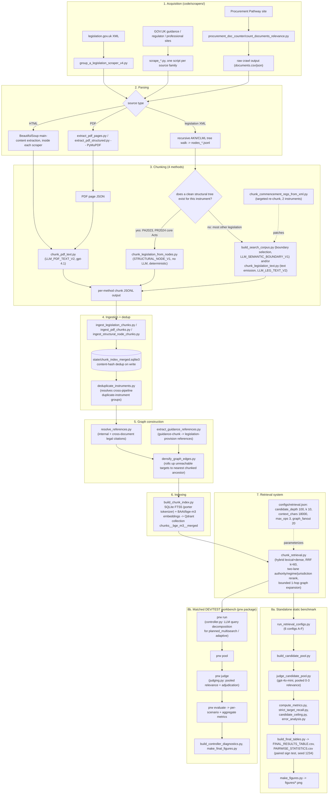

# Technical Appendix

Retrieval and adaptive-controller evaluation over a UK public procurement legal knowledge base.
This describes every stage from corpus construction through final metrics, in enough detail to
reproduce the reported analysis.

**Just want the commands to run, in order?** See `README.md`'s "Quickstart" section --
everything below is the detailed *why*, not a replacement for that ordered sequence.

## 0. End-to-end pipeline

### 0.1 Diagram



### 0.2 File-by-file table, in execution order

**This table documents how the corpus was originally built, from raw web sources through to
the final database -- it is a methodology record, not something you need to run to get the
final database.** The actual final, evaluated database's content is already exported and
shipped in this bundle (`code/corpus_export/data/{chunks,documents,edges,edges_v2}.jsonl`),
and `scripts/rebuild_search_index.py` (section 0.5) rebuilds a fully working search index
directly from that export -- no scraping, chunking, or ingestion required. Run the steps
below only if you want to reproduce or audit the *acquisition* methodology itself (e.g. to
understand how a specific instrument was scraped and chunked), not to obtain the database.
Nothing below is required to get the final database -- it's already part of the shipped
export, whatever the acquisition process below historically produced. To actually check that
the acquisition/chunking methodology reproduces, rather than take that on faith, see
`scripts/verify_deterministic_chunking.py` (README.md, "Verify the deterministic chunking
lane") -- it scrapes PA2023/PR2024 live today and confirms the fully-deterministic chunker's
output matches the shipped corpus exactly, provision by provision.

| # | Stage | Script(s) | Reads | Writes | Command |
|---|---|---|---|---|---|
| 1 | Acquire legislation | `code/scrapers/legislation/group_a_legislation_scraper_v4.py` (run this one -- the latest version; `_v1.py`/`_v2.py` are kept for reference/audit only). Needs `requests` and `lxml` (both in `code/requirements.txt`). Run from `code/`, since `--output-dir` is relative to it, not to `scrapers/legislation/` | legislation.gov.uk XML (AKN/CLML) | `processed/nodes.jsonl`, `references_*.jsonl`, `annotations_*.jsonl`, `legal_effects_*.jsonl` | `cd code && python scrapers/legislation/group_a_legislation_scraper_v4.py --source PA2023 --output-dir data/group_a_legislation_v4` |
| 1b | Rank cited-but-missing instruments (backfill, later in the pipeline -- needs the corpus already ingested, not right after step 1) | `collect_missing_references.py` -- reads the ingested corpus's held documents/URLs plus raw hyperlink records, AKN citation targets, and the full reference-resolution report to rank what's missing by citation frequency | `state/chunk_index_merged.sqlite3`, `normalized_html_json_v2/records/`, `corpus_minor_formats/xml/`, `data/search_corpus/reference_resolution_all.jsonl` (all included) | `evaluation/acquisition/missing_references.jsonl` | `cd code && python collect_missing_references.py --min-citations 1` |
| 1c | Acquire additional cited instruments (backfill) | `scrapers/legislation/scrape_missing_legislation.py` | `evaluation/acquisition/missing_references.jsonl` (from 1b), `state/chunk_index_merged.sqlite3` | same outputs as step 1, for the acquired instruments | `python scrapers/legislation/scrape_missing_legislation.py --top 10 --apply` |
| 2 | Acquire guidance/regulator/professional sources | `code/scrapers/scrape_*.py` (one script per source family) | fixed, pre-enumerated URL lists | raw HTML/PDF + provenance records | `python scrapers/scrape_<family>.py` |
| 3 | Acquire Procurement Pathway (raw discovery) | `code/scrapers/procurement_doc_counter/count_documents_relevance.py` + `seeds.json` | 58 seed roots | `documents.csv`/`documents.json`/`summary.json` | `python count_documents_relevance.py --seeds seeds.json --out crawl_output` |
| 4 | Parse PDFs | `extract_pdf_pages.py` / `extract_pdf_structured.py` (PyMuPDF/`fitz`) | raw PDF bytes | page-ordered JSON | see script `--help` |
| 5a | Chunk (deterministic, no LLM) | `chunk_legislation_from_nodes.py` -- for instruments with a clean structural parse (PA2023, PR2024 core Acts) | `nodes_*.jsonl` | chunk JSONL, method tag `STRUCTURAL_NODE_V1` | `python chunk_legislation_from_nodes.py --doc <id> --nodes <path> --out <path>` |
| 5b-i | Chunk (legislation, boundary-selection) | `build_search_corpus.py` -- produces `LLM_SEMANTIC_BOUNDARY_V1` | raw parsed source blocks (`--input-root`) | chunk JSONL (`--output-dir`) | `python build_search_corpus.py all --input-root <blocks dir> --output-dir <out>` |
| 5b-ii | Chunk (legislation, text-emission) | `chunk_legislation_text.py` -- produces `LLM_LEG_TEXT_V2` | `data/legislation_acquired/` | chunk JSONL | `python chunk_legislation_text.py --dir data/legislation_acquired --out <out> --model gpt-4o-mini --window-chars 9000 --min-coverage 0.80` |
| 5c | Chunk (PDF, LLM-assisted) | `chunk_pdf_text.py` -- produces `LLM_PDF_TEXT_V2` | PDF page JSON (step 4) | `data/pdf_chunks/` | `python chunk_pdf_text.py <pages_json...> --out data/pdf_chunks --model gpt-4.1 --window-chars 9000 --min-coverage 0.80` |
| 5d | Targeted re-chunk (2 instruments) | `chunk_commencement_regs_from_xml.py` -- fixes UKSI_2024_716 and UKSI_2024_959 | source XML | corrected chunk JSONL | `python chunk_commencement_regs_from_xml.py` |
| 6 | Ingest chunks into the index DB | `ingest_legislation_chunks.py`, `ingest_pdf_chunks.py`, `ingest_structural_node_chunks.py` | each method's chunk JSONL output | `state/chunk_index_merged.sqlite3` | `python ingest_legislation_chunks.py --chunks-dir data/legislation_chunks --db state/chunk_index_merged.sqlite3 --apply` |
| 7 | Resolve duplicate-instrument groups | `deduplicate_instruments.py` -- flags cross-pipeline duplicate instruments non-destructively (`superseded_by`) | `state/chunk_index_merged.sqlite3` | same DB, flags updated | `python deduplicate_instruments.py --db state/chunk_index_merged.sqlite3 --apply` |
| 8 | Build citation graph | `resolve_references.py`, `extract_guidance_references.py` | `state/chunk_index_merged.sqlite3` | same DB, `REFERENCES`/`CROSS_REFERS_TO` edges added | see each script's `--help` |
| 9 | Densify graph | `densify_graph_edges.py` -- rolls up unreachable reference targets | `state/chunk_index_merged.sqlite3` | same DB | `python densify_graph_edges.py --db state/chunk_index_merged.sqlite3 --apply` |
| 10 | Build the search index | `build_chunk_index.py` -- SQLite FTS5 (porter) + `BAAI/bge-m3` embeddings into Qdrant | `state/chunk_index_merged.sqlite3` | populated FTS5 index + Qdrant collection | `python build_chunk_index.py` |
| 11 | Retrieve | `chunk_retrieval.py` (`search()` / `search_two_lanes()`), parameterised by `configs/retrieval.json` | the index from step 10 | ranked candidate/final-evidence lists | `python -m prw run --system {hybrid,legal_static,planned_multisearch,adaptive} ...` or `run_retrieval_configs.py` (standalone, 6 configs) |
| 12a | Standalone benchmark: pool + judge | `build_candidate_pool.py`, `judge_candidate_pool.py` | retrieval output (6 configs) | pooled candidates, judgments | `python judge_candidate_pool.py ...` |
| 12b | Standalone benchmark: metrics + diagnostics | `compute_metrics.py`, `strict_target_recall.py`, `candidate_ceiling.py` / `candidate_ceiling_CORRECTED.py`, `error_analysis.py` | judgments + `gold_evidence.jsonl` | metrics JSON/CSV | see each script's `--help` |
| 12c | Standalone benchmark: final tables + figures | `build_final_tables.py` (paired sign test, bootstrap CI, seed 1234), `make_figures.py` | metrics from 12b | `FINAL_RESULTS_TABLE.csv`, `PAIRWISE_STATISTICS.csv`, `figures/*.png` | `python build_final_tables.py && python make_figures.py` |
| 13a | Matched workbench: run 4 systems | `python -m prw run` | `data/{dev,test_sealed}/scenarios.jsonl`, `configs/retrieval.json` | `runs/<split>/<system>/runs.jsonl` | `python -m prw run --scenarios <path> --system <name>` |
| 13b | Matched workbench: pool + judge | `python -m prw pool`, `python -m prw judge` | runs from 13a | `judgments/.../judgments_raw.jsonl`, `qrels_silver.jsonl` | `python -m prw judge --pool <path>` |
| 13c | Matched workbench: evaluate + freeze | `python -m prw evaluate`, `python -m prw freeze` | judgments from 13b | per-scenario + aggregate metrics; `prw_freeze_record.json` | `python -m prw evaluate ...` |
| 13d | Matched workbench: diagnostics + figures | `build_controller_diagnostics.py`, `make_final_figures.py` | evaluate output from 13c | `CONTROLLER_DIAGNOSTICS.csv`, `figures/*.png` | see each script's `--help` |

Run `_v4.py` -- it's the latest version, and `chunk_legislation_from_nodes.py`'s
`_normalize_node()` step is written to accept its field naming (`node_type`/`eid`) directly.
`_v1.py` and `_v2.py` also produce compatible output (the same `_normalize_node()` step
accepts their older field naming too) and are kept in the repo for reference/audit, but
there is no need to run them.

Steps 1b and 1c (backfilling cited-but-missing instruments) are not a simple follow-up to step
1 -- they need the corpus already ingested, since `collect_missing_references.py` ranks what's
missing partly from the reference resolver's own output (step 8), which itself needs the
ingested corpus. Both scripts and all of their raw inputs are included in this bundle
(`normalized_html_json_v2/records/`, `corpus_minor_formats/xml/`,
`data/search_corpus/reference_resolution_all.jsonl`), so this backfill is fully re-runnable,
just later in the sequence than steps 1-1a.

### 0.3 Not part of reproducing the reported results

- `build_chunk_representations.py` -- an experiment (sentence/summary-level embeddings);
  `chunk_retrieval.py` does not reference these representations.
- `optimize_chunking_prompt.py` -- a prompt-development tool; the prompts it produced are what
  is embedded in `chunk_legislation_text.py`/`chunk_pdf_text.py` today.
- The frozen baseline system (`kg__bge_m3__text_focused_v1` Qdrant collection,
  `state/procurement_kg.sqlite3`) -- an older, separate node-level corpus not used by the
  current pipeline.

### 0.4 Reproducibility scope

- Ingestion, dedup, graph construction, indexing, and retrieval are deterministic given the
  same chunk files and index.
- Corpus text-emission chunking, controller planning/observation, and judging call an LLM with
  no fixed temperature/seed (`prw/llm.py`) -- these are not byte-for-byte reproducible on
  rerun. `results/` ships the actual saved outputs of these steps.
- Metrics/tables/figures computed from already-saved data (steps 12b, 12c, 13c, 13d) are
  deterministic.
- The Procurement Pathway curation step (raw crawl -> final annotated manifest) cannot be
  rerun; see `provenance/missing_artifacts.md`.

### 0.5 The deployed application layer

`chunk_api.py` is a FastAPI service exposing `/health`, `/search`, `/answer` (a cited answer
generated over retrieved evidence, verified against the claims it cites -- see
`answer_query.py::verify`/`check_claim_grounding`), `/refine`, and `/chunk/{chunk_id}`; it also
serves a minimal built-in HTML/JS page at `/`. `streamlit_app.py` is a fuller Streamlit UI
("Procurement KG Assistant") that talks to the same backend via `procurement_kg/ui.py`'s
`call_answer()`. Required siblings: `answer_query.py`, `refine_query.py`, `query_expansion.py`
(all at `code/`, sibling to `chunk_api.py`, where its bare `import` statements resolve).

This bundle ships the actual final chunk/document/edge data
(`code/corpus_export/data/{chunks,documents,edges,edges_v2}.jsonl`, 91 MB: every live chunk
(22,042), document (2,078), structural edge (15,678), and reference edge (11,922), exported
directly from the frozen database) rather than a pre-built database or vector-index binary.
`scripts/rebuild_search_index.py` rebuilds a working index from this export in 3 stages:

1. `build_chunk_index.py lexical` -- builds the SQLite FTS5 index and base `edges` table,
   deterministically, no model call.
2. `densify_graph_edges.py --apply` -- adds and populates the `retrieval_source_id`,
   `retrieval_target_id`, `retrieval_resolution` columns `chunk_retrieval.py` requires.
3. `build_chunk_index.py dense` -- embeds every chunk's `embedding_text` with the local
   `BAAI/bge-m3` model and upserts into Qdrant. No external API call.

Run against the complete 22,042-chunk / 27,600-edge export, the dense stage takes roughly
25 minutes on CPU alone. `/search` and `/health` require no OpenAI API key; only `/answer` and
`/refine` do. `/health`'s `documents` count on a freshly-rebuilt database reads 1,737, not
2,078 -- `build_chunk_index.py` derives the documents table by aggregating the *chunks* table
itself, so it counts only documents with at least one live chunk; the remaining 341 correspond
to documents whose chunks were all superseded as cross-pipeline duplicates.

**Quickstart**:
```bash
docker compose up -d qdrant
cd code && pip install -r requirements.txt && cd ..   # rebuild_search_index.py needs
                                                        # qdrant-client/sentence-transformers installed first
python3 scripts/rebuild_search_index.py
cp .env.example .env
cd code && python chunk_api.py
```

## 1. System overview

Three components, in dependency order:

1. **Corpus construction** -- acquisition, parsing, chunking, and graph construction over UK
   procurement legal/guidance sources, producing a queryable SQLite index plus a Qdrant dense
   vector index.
2. **Retrieval system** -- a hybrid lexical/dense/graph retriever (`chunk_retrieval.py`) with
   four evaluated configurations: `hybrid`, `legal_static`, `planned_multisearch` (LLM query
   decomposition, no evidence inspection), `adaptive` (LLM query decomposition with iterative
   evidence inspection, bounded to 3 operations).
3. **Evaluation** -- a scenario-based benchmark (60 legal-question scenarios, 40 dev / 20 test)
   with LLM-judged pooled passage relevance and reference-independent strict target recall as
   primary metrics, plus a standalone 6-configuration static-retrieval comparison.

## 2. Corpus construction

### 2.1 Acquisition

Nine source-family scrapers (`code/scrapers/`), each fixed-URL/non-recursive by design, covering
primary and secondary legislation (legislation.gov.uk XML), official government guidance
(gov.uk collections), regulator/technical guidance, and professional/practitioner commentary.
The Procurement Pathway discovery crawler is at
`code/scrapers/procurement_doc_counter/count_documents_relevance.py`. The final curated
manifest for that source family (`corpus_manifests/procurement_pathway_urls.jsonl`, 1,690 URLs)
is a refined version of the crawler's raw output; the refinement code is not available (see
`provenance/missing_artifacts.md`).

### 2.2 Parsing

- **Legislation**: `code/` root scripts (`chunk_legislation_from_nodes.py`,
  `chunk_legislation_text.py`) parse legislation.gov.uk XML (AKN or CLML, auto-detected) via a
  recursive tree walk preserving `eId`, `heading`, `number`, and hierarchy.
- **PDF**: PyMuPDF (`fitz`) text extraction, page-ordered, with hyphenation repair and
  furniture (header/footer) flagging.
- **HTML**: BeautifulSoup, main-content-container extraction with boilerplate removal.

### 2.3 Chunking

Four chunking methods, two involving an LLM:

| Method | Mechanism | Producing script |
|---|---|---|
| `LLM_SEMANTIC_BOUNDARY_V1` | LLM selects block boundaries; text reconstructed from immutable source blocks by code | `build_search_corpus.py` |
| `LLM_LEG_TEXT_V2` | LLM emits chunk text directly (legislation) | `chunk_legislation_text.py` |
| `LLM_PDF_TEXT_V2` | LLM emits chunk text directly (PDF sources) | `chunk_pdf_text.py` |
| `STRUCTURAL_NODE_V1` | deterministic XML-tree walk, no LLM | `chunk_legislation_from_nodes.py` |

Models used: `gpt-4o-mini` (legislation text-emission, boundary selection), `gpt-4.1` (PDF
text-emission).

### 2.4 Ingestion and graph construction

`ingest_legislation_chunks.py` / `ingest_pdf_chunks.py` / `ingest_structural_node_chunks.py`
insert chunks with content-hash-based deduplication; `deduplicate_instruments.py` resolves
cross-acquisition-path duplicate legal instruments; `resolve_references.py` and
`extract_guidance_references.py` (both at `code/`) resolve internal/cross-document legal
citations into a reference graph; `densify_graph_edges.py` rolls up unreachable reference
targets to their nearest chunked ancestor; `build_chunk_index.py` builds the final SQLite FTS5
lexical index and Qdrant dense vector index.

### 2.5 Final corpus snapshot

2,078 documents, 27,558 total chunk rows, 22,042 live/queryable chunks, 27,600 graph edges
(CONTAINS 6,489, HAS_CHUNK 9,189, REFERENCES 7,159, CROSS_REFERS_TO 4,763).

## 3. Retrieval system

`code/chunk_retrieval.py` implements `search()` (single-pass hybrid lexical+dense+graph
retrieval with legal two-lane interleaving) and `search_two_lanes()`. Configuration
(`code/procurement_research_workbench_v1/configs/retrieval.json`):

```json
{
  "candidate_depth": 100,
  "retrieval_depth": 20,
  "k": 10,
  "context_chars": 18000,
  "max_retrieval_operations": 3,
  "graph_fanout": 20,
  "initial_graph": true
}
```

Final evidence budget is 10 chunks total (5/5 role-quota interleave with backfill), identical
across all four evaluated systems. `planned_multisearch` and `adaptive` additionally use an LLM
controller (`code/procurement_research_workbench_v1/prw/controller.py`) for query
decomposition; `adaptive` additionally inspects intermediate evidence and can issue further
searches, bounded to 3 total operations.

## 4. Evaluation pipeline

### 4.1 Benchmark construction

60 scenarios (40 dev / 20 test), each with corpus-verified gold evidence citations, spanning 8
suite categories (exact-anchor, semantic, vocabulary-mismatch, graph-multi-hop, applicability,
practical-guidance, authority, compound). Construction method, gold-resolution report, and
split-independence audit are in `code/evaluation/final_retrieval_benchmark/` and its outputs.

### 4.2 Two evaluation tracks

1. **Standalone static-retrieval comparison** (`code/evaluation/final_retrieval_benchmark/`):
   6 configurations (lexical, dense, hybrid, hybrid+priors, hybrid+graph, two-lane legal)
   scored by `compute_metrics.py` (nDCG@10, Hit@10, MRR, requirement coverage),
   `strict_target_recall.py` (judge-independent recall), `candidate_ceiling.py`
   (candidate-generation vs. ranking failure diagnosis), `error_analysis.py`, `make_figures.py`.
2. **Matched DEV/TEST evaluation** (`code/procurement_research_workbench_v1/prw`): the four
   production systems compared under identical retrieval/evidence budgets, with pooled
   LLM-judged passage relevance (`prw judge`/`prw evaluate`) as the primary metric.

### 4.3 Judge configuration

All judge/controller/adjudicator slots use `gpt-4o-mini`. Judging validates model output
structurally (positional requirement arrays, chunk-id-only citations, one bounded repair
attempt on validation failure) before accepting any label.

### 4.4 Exact commands

```bash
# Retrieval, per system
python -m prw run --scenarios <scenarios.jsonl> --system {hybrid|legal_static|planned_multisearch|adaptive} \
  --snapshot <label> --out runs/<system> [--allow-network --max-requests N]

# Pooling + judging
python -m prw pool --runs runs/*/runs.jsonl --final-only --out pool/<label>
python -m prw judge --pool pool/<label>/candidate_pool.jsonl --scenarios <scenarios.jsonl> \
  --requirements <requirements.jsonl> --out judgments/<label> --allow-network --adjudicate --max-requests N

# Metrics
python -m prw evaluate --runs runs/*/runs.jsonl --qrels judgments/<label>/qrels_silver.jsonl \
  --requirements <requirements.jsonl> --out results/<label> --k 10

# Standalone benchmark
python run_retrieval_configs.py
python compute_metrics.py
python strict_target_recall.py
python candidate_ceiling.py
```

### 4.5 Freeze record (TEST-stage reproducibility)

Before the single TEST execution, all retrieval configs, controller code, model identities, and
dataset hashes were frozen and hashed (`prw_freeze_record.json`). Re-running
`prw run --freeze <freeze_record.json>` on the TEST split re-verifies these hashes before
executing, and refuses to run if any have changed.

## 5. Package versions and environment

- Python: 3.9.6 (corpus index build), 3.11+ / 3.10+ for the retrieval/evaluation packages.
  See `environment/environment_notes.md` for the currently-verified interpreter.
- Core dependencies (`code/requirements.txt`, `code/pyproject.toml`):
  `fastapi>=0.115,<1`, `openai>=1.68,<3`, `python-dotenv>=1.0,<2`, `qdrant-client>=1.13,<2`,
  `requests>=2.31,<3`, `streamlit>=1.38,<2`, `uvicorn[standard]>=0.34,<1`. Exact pinned
  versions: `environment/requirements-lock.txt`; full interpreter environment:
  `environment/pip-freeze.txt`.
- Evaluation workbench (`code/procurement_research_workbench_v1/pyproject.toml`): no hard
  runtime dependencies beyond the standard library; optional `pytest>=7`, `jsonschema>=4`,
  `matplotlib>=3.7`, `numpy>=1.24`, `scipy>=1.11`.
- Embedding model: `BAAI/bge-m3`, 1024 dimensions, cosine distance, normalized vectors.
- Vector store: Qdrant, collection `chunks__bge_m3__merged`.
- Corpus snapshot: `state/chunk_index_merged.sqlite3` (default `--db` value across every
  corpus/graph script).
- Lexical index: SQLite FTS5, `porter` tokenizer.
- LLM models: `gpt-4o-mini` (all controller/judge/adjudicator/generator slots). No temperature
  or seed is set on any LLM call in `prw/llm.py`.
- Random seeds: paired-bootstrap confidence intervals use seed `1234` (`prw/metrics.py`,
  `build_final_tables.py`); no other stochastic step is seeded.
- Repository commit: `79c488c7103078633159e26bdfe24e7410313821`.
- Retrieval protocol constants: candidate depth 100, retrieval depth 20, final evidence budget
  10 chunks, context cap 18,000 characters, maximum 3 retrieval operations, graph fan-out 20,
  graph hops 1, RRF `k = 60` (set in `chunk_retrieval.py`'s fusion routine).

## 6. Data access

The underlying corpus source data (SQLite databases, scraped HTML/PDF caches) is not included
directly; its provenance (source URLs, acquisition method per family) is documented in section
2 above. All code needed to reconstruct the corpus from those same source URLs is included in
`code/`. The actual final chunk/document/edge data is included in
`code/corpus_export/data/` (see section 0.5).

## 7. Significance testing

- Test: two-sided exact paired sign test on `requirement_coverage` per scenario-group.
- Alpha: 0.05.
- Sample size: n=60 (standalone benchmark); n=37 (matched DEV, 3 scenarios excluded for
  unjudged candidates); n=17 (frozen TEST, 3 scenarios excluded likewise).
- Confidence intervals: 2000-sample bootstrap over paired per-scenario differences, seed 1234
  (`build_final_tables.py::paired_bootstrap`, `prw/metrics.py::paired_bootstrap`).
- No multiple-comparison correction applied; raw, uncorrected p-values are reported throughout.
- Reproducing this table: `python3 code/evaluation/final_retrieval_benchmark/build_final_tables.py`
  or `python -m prw evaluate ...` + `prw/metrics.py`'s paired-bootstrap helper.

## 8. `F_two_lane` vs. `legal_static`

Both implement the same high-level idea (a legal-aware two-lane retrieval strategy with role
interleaving), but they are not numerically identical configurations:

| Parameter | Standalone `F_two_lane` | Workbench `legal_static` |
|---|---|---|
| Candidate depth | 50 (`run_retrieval_configs.py::DEPTH`) | 100 (`configs/retrieval.json::candidate_depth`) |
| Final-10 construction | top-10 by raw fusion score across merged lanes | 5/5 role-quota with backfill (`prw/controller.py::assemble`) |
| Query text | scenario's bare `query` field | full `user_message` (scenario text + query concatenated), per `prw/benchmark.py` |
| Controller integration | none (single retrieval call per scenario) | invoked through the same harness as the other three matched systems |

Treat these as related implementations of the same idea, evaluated under different settings,
not as the same experiment reported twice.

## 9. Known limitations

See `provenance/missing_artifacts.md`.

## 10. Artifact map

| Category | Location |
|---|---|
| Corpus acquisition code | `code/scrapers/` |
| Corpus acquisition frozen manifest (Procurement Pathway) | `corpus_manifests/procurement_pathway_urls.jsonl` |
| Chunking/parsing/ingestion code | `code/*.py` |
| Graph construction code | `code/procurement_kg/`, `code/resolve_references.py`, `code/extract_guidance_references.py` |
| Production retriever | `code/chunk_retrieval.py`, `code/chunk_api.py` |
| Standalone benchmark (code + data + metrics) | `code/evaluation/final_retrieval_benchmark/` |
| Evaluation package (`prw`) | `code/procurement_research_workbench_v1/prw/` |
| Evaluation test data/schemas | `code/procurement_research_workbench_v1/{data,schemas}/` |
| Actual DEV/TEST dataset | `code/evaluation/final_retrieval_benchmark/workbench_schema/` |
| Raw DEV/TEST run/judgment artifacts | `results/{runs,judgments,pool,evaluate_output}/` |
| Environment record | `environment/` |
| Verification scripts | `scripts/` |
| Provenance/limitations documentation | `provenance/` |
